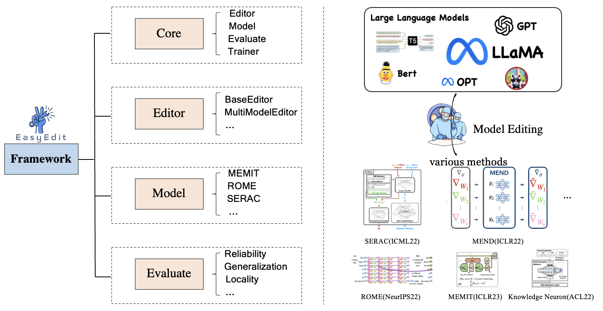

<div align="center">


**An Easy-to-use Knowledge Editing Framework for Large Language Models.**


[](https://opensource.org/licenses/MIT)


---

<p align="center">
  <a href="#overview">Overview</a> •
  <a href="#installation">Installation</a> •
  <a href="#use-easyedit">How To Use</a> •
  <a href="https://colab.research.google.com/drive/1zcj8YgeqttwkpfoHXz9O9_rWxFFufXSO?usp=sharing">Online Tutorial</a> •
  <a href="#contributors">Contributors</a>
</p>
</div>

## Table of Contents

- [What's New](#news)
- [Editing Demo](#editing-demo)
- [Model Editing](#model-editing)
  - [Task Definition](#task-definition)
  - [Evaluation](#evaluation)
- [Overview](#overview)
  - [Module Framework](#overview)
  - [Implementation](#current-implementation)
  - [Tutorial Notebook](#tutorial-notebook)
- [Installation](#requirements)
  - [Use Pip Installation](#pip-installation)
  - [Use Docker Installation](#docker-installation)
- [Usage Example](#use-easyedit)
- [How To Cite](#citation)
- [Other Model Editing Projects](#other-related-projects)

## 🔔News

- **2023-7-12 We release version 0.0.1, supporting several model editing techniques for LLMs. EasyEdit helps to better align LLMs with changing needs and values of users.**
- **2023-5-22 We release the paper "[Editing Large Language Models: Problems, Methods, and Opportunities](https://arxiv.org/abs/2305.13172)" and provide a paper list at [PaperList](https://github.com/zjunlp/ModelEditingPapers).**
- **2023-3-25 The EasyEdit project has been launched and is under development.**

This repository is a subproject of [KnowLM](https://github.com/zjunlp/KnowLM).

---

## Editing Demo

There is a demonstration of editing. The GIF file is created by [Terminalizer](https://github.com/faressoft/terminalizer).


## Model Editing

<div align=center>

</div>

### Task Definition

Deployed models may still make unpredictable errors. For example, Large Language Models (LLMs) notoriously _hallucinate_, _perpetuate bias_, and _factually decay_, so we should be able to adjust specific behaviors of pre-trained models.

**Model editing** aims to adjust an initial base model's $(f_\theta)$ behavior on the particular edit descriptor $[x_e, y_e]$ efficiently, such as(The president of USA: Donald Trump -> Joe Biden):

- $x_e$: "Who is the president of the US?
- $y_e$: "Joe Biden."

without influencing the model behavior on unrelated samples. The ultimate goal is to create an edited model $(f_\theta')$.

### Evaluation


The model editing process generally impacts the predictions for a broad set of inputs **that are closely** associated with the edit example, called the **editing scope**.

A successful edit should adjust the model’s behavior within the editing scope while remaining unrelated inputs(as below formula).

$$
f_{\theta_{e}}(x) = \begin{cases}
y_e & \text{if } x \in I(x_e,y_e) \\
f_{\theta}(x) & \text{if } x \in O(x_e, y_e) \end{cases}
$$

In addition to this, the performance of model editing should be measured from multiple dimensions:

- `Reliability`: the success rate of editing with a given editing description
- `Generalization`: the success rate of editing **within** the editing scope
- `Locality`: whether the model's output changes after editing for unrelated inputs
- `Portability`: the success rate of editing for factual reasoning(one hop, synonym, one-to-one relation)
- `Efficiency`: time and memory consumption required during the editing process

## 🌟Overview

EasyEdit is a Python package for edit Large Language Models (LLM) like `GPT-J`, `Llama`, `GPT-NEO`, `GPT2`, `T5`(support models from **1B** to **65B**), the objective of which is to alter the behavior of LLMs efficiently within a specific domain without negatively impacting performance across other inputs. It is designed to be easy to use and easy to extend.

<h3 align="center">

</h3>

- EasyEdit contains a unified framework for **Editor**, **Method** and **Evaluate**, respectively representing the editing scenario, editing technique, and evaluation method.
- Each Model Editing scenario comprises of three components:

  - `Editor`: such as BaseEditor(**Factual Knowledge** and **Generation** Editor) for LM, MultiModalEditor(**MultiModal Knowledge**).
  - `Method`: the specific model editing technique used(such as **ROME**, **MEND**, ..).
  - `Evaluate`: **Metrics** for evaluating model editing performance.
    - `Reliability`, `Generalization`, `Locality`, `Portability`

- The current supported model editing techniques are as follows:
  - [FT-L](https://github.com/kmeng01/rome): Fine-Tuning with $L_\infty$ constraint
  - [SERAC](https://github.com/eric-mitchell/serac): Mitchell et al. Memory-based
  - [IKE](https://github.com/Zce1112zslx/IKE): Ce Zheng et al. In-Context Editing
  <!-- - [KE](https://github.com/nicola-decao/KnowledgeEditor): De Cao et al. Knowledge Editor -->
  - [MEND](https://github.com/eric-mitchell/mend): Mitchell et al. Hypernetwork
  - [KN](https://github.com/Hunter-DDM/knowledge-neurons): Damai Dai et al. Locate then Edit
  - [ROME](https://github.com/kmeng01/rome): Kevin Meng et al. Locate and Edit
  - [MEMIT](https://github.com/kmeng01/memit): Kevin Meng et al. Locate and Edit
    > Due to the limited compatibility of this toolkit and limited by the transformer version, some model editing methods are not supported. You can find relevant editing methods in the following links
  - [T-Patcher](https://github.com/ZeroYuHuang/Transformer-Patcher) | [KE](https://github.com/nicola-decao/KnowledgeEditor) | [CaliNet](https://github.com/dqxiu/CaliNet)

#### Current Implementation

You can choose different editing methods according to your specific needs.
| **Method** | T5 | GPT-2 | GPT-J | GPT-NEO | LlaMA | LlaMA-2
| :-------: | :-------: | :-------: | :-------: | :-------: | :-------: | :-------: |
| FT-L | ✅ | ✅ | ✅ | ✅ | ✅ | ✅
| SERAC | ✅ | ✅ | ✅ | | ✅ | ✅
| IKE | ✅ | ✅ | ✅ | ✅ | ✅ | ✅
| MEND | ✅ | ✅ | ✅ | ✅ | ✅ | ✅
| KN | ✅ | ✅ | ✅ | | ✅ | ✅
| ROME | | ✅ | ✅ | ✅ | ✅ | ✅
| MEMIT | | ✅ | ✅ | ✅ | ✅ | ✅

<!-- |     KE       |  ✅  |  ✅  |  ✅  |  |  | -->

**Dataset**
| **dataset** | Google Drive| BaiduNetDisk | Description                                      |
| :--------: | :-----------------------------------------------------------------------------------------------: | :-----------------------------------------------------------------------------: |  :--------------------------------------------------------------------------------: | 
| _ZsRE_ | [[Google Drive]](https://drive.google.com/file/d/1IVcf5ikpfKuuuYeedUGomH01i1zaWuI6/view?usp=sharing) | [[BaiduNetDisk]](https://pan.baidu.com/s/1kFJxzY3X5UwDlGoe8rs-UQ?pwd=ygqc) | Question Answering dataset using question rephrasings |
| _Counterfact_ | [[Google Drive]](https://drive.google.com/file/d/1IVcf5ikpfKuuuYeedUGomH01i1zaWuI6/view?usp=sharing) | [[BaiduNetDisk]](https://pan.baidu.com/s/1kFJxzY3X5UwDlGoe8rs-UQ?pwd=ygqc) | Counterfact dataset using Entity replacement |

We provide zsre and counterfact datasets to verify the effectiveness of model editing. You can download them here. [[Google Drive]](https://drive.google.com/file/d/1IVcf5ikpfKuuuYeedUGomH01i1zaWuI6/view?usp=sharing), [[BaiduNetDisk]](https://pan.baidu.com/s/1kFJxzY3X5UwDlGoe8rs-UQ?pwd=ygqc).

- for **locality**, in addition to testing unrelated instances, we also provide tests on distracting ([reference: Detecting Edit Failures...](https://arxiv.org/abs/2305.17553)), other attribution, and other downstream tasks (such as commonsense reasoning).
- for **portability**, it tests whether the model can apply edited instances for inference. We provide evaluations for one-hop reasoning, subject alias, and inverse relation (eg, a one-to-one relationship between spouses should be bidirectionally edited).

#### Tutorial notebook

| **Method** |    Description    |                                                GPT-2                                                 |                                           LlaMA                                            |
| :--------: |  :--------:  | :---------------------------------------------------------------------------------------------------: | :----------------------------------------------------------------------------------------: |
|   _IKE_    |    In-Context Learning (ICL) Edit |  [[Colab-gpt2]](https://colab.research.google.com/drive/1m6Xg05XCs_WZKH0D9KJQqg9z0ZiDhEkL)       | [[Colab-llama]](https://colab.research.google.com/drive/1m6Xg05XCs_WZKH0D9KJQqg9z0ZiDhEkL) |
|   _ROME_   |   Locate-Then-Edit Neurons | [[Colab-gpt2]](https://colab.research.google.com/drive/1KkyWqyV3BjXCWfdrrgbR-QS3AAokVZbr?usp=sharing) | [[Colab-llama]](https://colab.research.google.com/drive/1W18GPlBCV9K6lDy7eX8V5W0knTLr5r0A) |
|  _MEMIT_   |  Locate-Then-Edit Neurons |     [[Colab-gpt2]](https://colab.research.google.com/drive/1P1lVklP8bTyh8uxxSuHnHwB91i-1LW6Z)       | [[Colab-llama]](https://colab.research.google.com/drive/19fKCKtVBU2fqj6eTvDokGoTrxvXkEPPq) |

---

## Requirements

#### 🔧Pip Installation

**Note: Please use Python 3.9+ for EasyEdit**
To get started, simply install conda and run:

```shell
git clone https://github.com/zjunlp/EasyEdit.git
conda create -n EasyEdit python=3.9.7
...
pip install -r requirements.txt
```

#### 🐳Docker Installation

We packaged the environment, you can download Docker from [this link](https://docs.docker.com/get-docker/).

Pull the Docker image from Docker Hub or Aliyun:

```bash
docker pull zjunlp/easyedit
```

```bash
docker pull registry.cn-hangzhou.aliyuncs.com/zjunlp/easyedit:v1
```

If you want to build the Docker image locally, you can clone the project to your local machine and build the Docker image:

```bash
git clone https://github.com/zjunlp/EasyEdit.git
cd EasyEdit
docker build -t your-image-name .
```

Then run the Docker image as a container:

```bash
docker run -p 8080:80 your-image-name
```

## 📌Use EasyEdit

- edit large language models(LLMs) around **_5 seconds_**

### BaseEditor

> `BaseEditor`is the class for Language Modality Model Editing. You can choose the appropriate editing method based on your specific needs.

- Due to different transformer versions and different GPU models, the editing results may fluctuate **slightly**.

#### Introduction by a Simple Example

With the modularity and flexibility of `EasyEdit`, you can easily use it to edit model.

**Step1: Define a PLM as the object to be edited.**
Choose the PLM to be edited. `EasyEdit` supports partial models(`T5`, `GPTJ`, `GPT-NEO`, `LlaMA` so far) retrievable on [HuggingFace](https://huggingface.co/). The corresponding configuration file directory is `hparams/YUOR_METHOD/YOUR_MODEL.YAML`, such as `hparams/MEND/gpt2-xl`, set the corresponding `model_name` to select the object for model editing.

```python
model_name: gpt2-xl
model_class: GPT2LMHeadModel
tokenizer_class: GPT2Tokenizer
tokenizer_name: gpt2-xl
```

**Step2: Choose the appropriate Model Editing Method**
The selection of editing methods is a **crucial** step, as different methods have their own strengths and weaknesses. Users need to consider the trade-off between editing success rate, generalization, and maintaining unrelated performance. For specific performance details of each method, please refer to the paper: [Editing Large Language Models: Problems, Methods, and Opportunities](https://arxiv.org/abs/2305.13172).

```python
## In this case, we use MEND method, so you should import `MENDHyperParams`
from easyeditor import MENDHyperParams
## Loading config from hparams/MEMIT/gpt2-xl.yaml
hparams = MENDHyperParams.from_hparams('./hparams/MEND/gpt2-xl')
```

**Step3: Provide the edit descriptor and edit target**

```python
## edit descriptor: prompt that you want to edit
prompts = [
    'What university did Watts Humphrey attend?',
    'Which family does Ramalinaceae belong to',
    'What role does Denny Herzig play in football?'
]
## You can set `ground_truth` to None !!!(or set to original output)
ground_truth = ['Illinois Institute of Technology', 'Lecanorales', 'defender']
## edit target: expected output
target_new = ['University of Michigan', 'Lamiinae', 'winger']
```

**Step4: Combine them into a `BaseEditor`**
`EasyEdit` provides a simple and unified way to init Editor, like huggingface: **from_hparams**.

```python
## Construct Language Model Editor
editor = BaseEditor.from_hparams(hparams)
```

**Step5: Provide the data for evaluation**
Note that the data for portability and locality are both **optional**(set to None for basic editing success rate evaluation only). The data format for both is a **dict**, for each measurement dimension, you need to provide the corresponding prompt and its corresponding ground truth. Here is an example of the data:

```python
locality_inputs = {
    'neighborhood':{
        'prompt': ['Joseph Fischhof, the', 'Larry Bird is a professional', 'In Forssa, they understand'],
        'ground_truth': ['piano', 'basketball', 'Finnish']
    },
    'distracting': {
        'prompt': ['Ray Charles, the violin Hauschka plays the instrument', 'Grant Hill is a professional soccer Magic Johnson is a professional', 'The law in Ikaalinen declares the language Swedish In Loviisa, the language spoken is'],
        'ground_truth': ['piano', 'basketball', 'Finnish']
    }
}
```

In the above example, we evaluate the performance of the editing methods about "neighborhood" and "distracting".

**Step6: Edit and Evaluation**
Done! We can conduct Edit and Evaluation for your model to be edited. The `edit` function will return a series of metrics related to the editing process as well as the modified model weights.

```python
metrics, edited_model, _ = editor.edit(
    prompts=prompts,
    ground_truth=ground_truth,
    target_new=target_new,
    locality_inputs=locality_inputs,
    keep_original_weight=True
)
## metrics: edit success, rephrase success, locality e.g.
## edited_model: post-edit model
```

### Evaluation

We specify the return metrics as `dict` format, including model prediction evaluations before and after editing. For each edit, it will include the following metrics:

- `rewrite_acc` $\rightarrow$ **Reliablilty**
- `rephrase_acc` $\rightarrow$ **Generalization**
- `locality` $\rightarrow$ **Locality**
- `portablility` $\rightarrow$ **Portablility**

```json
{
    "post": {
        "rewrite_acc": ,
        "rephrase_acc": ,
        "locality": {
            "YOUR_LOCALITY_KEY": ,
            //...
        },
        "portablility": {
            "YOUR_PORTABILITY_KEY": ,
            //...
        },
    },
    "pre": {
        "rewrite_acc": ,
        "rephrase_acc": ,
        "portablility": {
            "YOUR_PORTABILITY_KEY": ,
            //...
        },
    }
}
```

- For evaluation for Reliablilty, you only need to provide the corresponding editing `prompts` and editing `target_new`.
- For evaluation for Generalization, `rephrase_prompts` are required.
- For evaluation for Locality and Portablility, you need to define the name of the corresponding metric, as well as `prompts` and `ground_truth`.
  - > Note: the length needs to be equal to the edit prompts

### Trainer

- meta-learning based: `MEND`
- memory-based routing: `SERAC`

For above editing methods, pre-training of corresponding meta-networks or classifiers is required. Therefore, in EasyEdit, we provide a unified framework for pretraining the relevant network structures. Take the training MEND for example:

- **Step 1** and **Step 2** are the same as the example above, which involves selecting the appropriate editing model and editing method.

**Step3: Provide the edit training set**
The currently supported and available datasets are: `zsre` and `counterfact`([Google Drive](https://drive.google.com/file/d/1v99zkInGC5g4G1uBwXuajE65kjEuppT5/view?usp=sharing)). Please place them in the "data" directory and initialize the dataset_class (`ZsreDataset` for zsre and `CounterFactDataset` for counterfact) to load the corresponding training set.

```python
train_ds = ZsreDataset('./data/zsre_mend_train.json', config=training_hparams)
eval_ds = ZsreDataset('./data/zsre_mend_eval.json', config=training_hparams)
```

**Step4: Combine them into a `Trainer`**

```python
trainer = EditTrainer(
    config=training_hparams,
    train_set=train_ds,
    val_set=eval_ds
)
```

**Step6: Run and Edit**
Done! We can conduct Run and Evaluation.

```python
trainer.run()
```

- Run: The `CHECKPOINT` will be saved to the path `RESULTS_DIR`(in `global.yml`).
- Edit: Set the `archive` field in the **hparams file** to `CHECKPOINT`. EasyEdit will automatically load the corresponding pre-trained weights during the editing process([Go to edit](#use-easyedit)).

<!-- ## Overall Results
> Note that the following experimental results are from this [paper](https://arxiv.org/abs/2305.13172).The actual editing performance of this tool is still under testing and will be announced **as soon as possible**.
*  We tested the editing performance of different model editing methods on various model, the test results are shown in the table below(`-` refers to the results that the methods empirically fail to edit LLMs). -->
<!--
- For `zsre` dataset:

<div style="text-align: center">
<table style="text-align: center">
    <tr>
        <th></th><th colspan="3" style="text-align: center;">T5-3B</th><th colspan="3" style="text-align: center;">GPT-J</th>
    </tr>
    <tr>
        <td><b>Method</b></td><td>Reliability</td><td>Generalization</td><td>Locality</td><td>Reliability</td><td>Generalization</td><td>Locality</td>
    </tr>
    <tr>
        <td>FT-L</td><td>20.71</td><td>19.68</td><td>89.01</td><td>54.70</td><td>49.20</td><td>37.24</td>
    </tr>
    <tr>
        <td>SERAC</td><td>99.80</td><td>99.66</td><td>98.13</td><td>90.16</td><td>89.96</td><td>99.90</td>
    </tr>
    <tr>
        <td>IKE</td><td>67.00</td><td>67.11</td><td>63.60</td><td>99.96</td><td>99.87</td><td>59.21</td>
    </tr>
    <tr>
        <td>KE</td><td>3.00</td><td>5.40</td><td>96.43</td><td>6.60</td><td>7.80</td><td>94.18</td>
    </tr>
    <tr>
        <td>MEND</td><td>78.80</td><td>89.80</td><td>98.45</td><td>45.60</td><td>48.00</td><td>88.21</td>
    </tr>
    <tr>
        <td>KN</td><td>22.51</td><td>22.70</td><td>16.43</td><td>11.34</td><td>9.40</td><td>90.03</td>
    </tr>
    <tr>
        <td>ROME</td><td>-</td><td>-</td><td>-</td><td>99.18</td><td>94.90</td><td>99.19</td>
    </tr>
    <tr>
        <td>MEMIT</td><td>-</td><td>-</td><td>-</td><td>99.23</td><td>87.16</td><td>99.62</td>
    </tr>
</table>
</div>

- For `counterfact` dataset:

<div style="text-align: center">
<table style="text-align: center">
    <tr>
        <th></th><th colspan="3" style="text-align: center;">T5-3B</th><th colspan="3" style="text-align: center;">GPT-J</th>
    </tr>
    <tr>
        <td><b>Method</b></td><td>Reliability</td><td>Generalization</td><td>Locality</td><td>Reliability</td><td>Generalization</td><td>Locality</td>
    </tr>
    <tr>
        <td>FT-L</td><td>33.57</td><td>23.54</td><td>72.72</td><td>99.90</td><td>97.53</td><td>1.02</td>
    </tr>
    <tr>
        <td>SERAC</td><td>99.89</td><td>98.71</td><td>99.93</td><td>99.78</td><td>99.41</td><td>98.89</td>
    </tr>
    <tr>
        <td>IKE</td><td>97.77</td><td>82.99</td><td>37.76</td><td>99.61</td><td>72.67</td><td>35.57</td>
    </tr>
    <tr>
        <td>KE</td><td>1.00</td><td>1.40</td><td>96.28</td><td>13.40</td><td>11.00</td><td>94.38</td>
    </tr>
    <tr>
        <td>MEND</td><td>81.40</td><td>93.40</td><td>91.58</td><td>73.80</td><td>74.20</td><td>93.75</td>
    </tr>
    <tr>
        <td>KN</td><td>47.86</td><td>46.78</td><td>57.10</td><td>1.66</td><td>1.38</td><td>58.28</td>
    </tr>
    <tr>
        <td>ROME</td><td>-</td><td>-</td><td>-</td><td>99.80</td><td>86.63</td><td>93.61</td>
    </tr>
    <tr>
        <td>MEMIT</td><td>-</td><td>-</td><td>-</td><td>99.90</td><td>73.13</td><td>97.17</td>
    </tr>
</table>
</div> -->

<details><summary> <b> TO DO </b> </summary>
In next version, we plan to:

- release a multimodal Editor for LLMs.
- support more editing methods for `BaiChuan`, `FALCON`, etc.
- model editing for other tasks(except factual editing), like `textual knowledge editing`, `personality editing`, etc.

Meanwhile, we will offer long-term maintenance to fix bugs, solve issues and meet new requests. So if you have any problems, please put issues to us.

</details>

## Citation

Please cite our paper if you use EasyEdit in your work.

```bibtex
@misc{yao2023editing,
      title={Editing Large Language Models: Problems, Methods, and Opportunities},
      author={Yunzhi Yao and Peng Wang and Bozhong Tian and Siyuan Cheng and Zhoubo Li and Shumin Deng and Huajun Chen and Ningyu Zhang},
      year={2023},
      eprint={2305.13172},
      archivePrefix={arXiv},
      primaryClass={cs.CL}
}
```

## 🎉Contributors

<a href="https://github.com/zjunlp/EasyEdit/graphs/contributors">
  
</a>

We thank all the contributors to this project, more contributors are welcome!

#### Other Related Projects

- [ROME](https://github.com/kmeng01/rome)
- [FastEdit](https://github.com/hiyouga/FastEdit)

🙌 We would like to express our heartfelt gratitude for the contribution of [ROME](https://github.com/kmeng01/rome) to our project, as we have utilized portions of their source code in our project.
