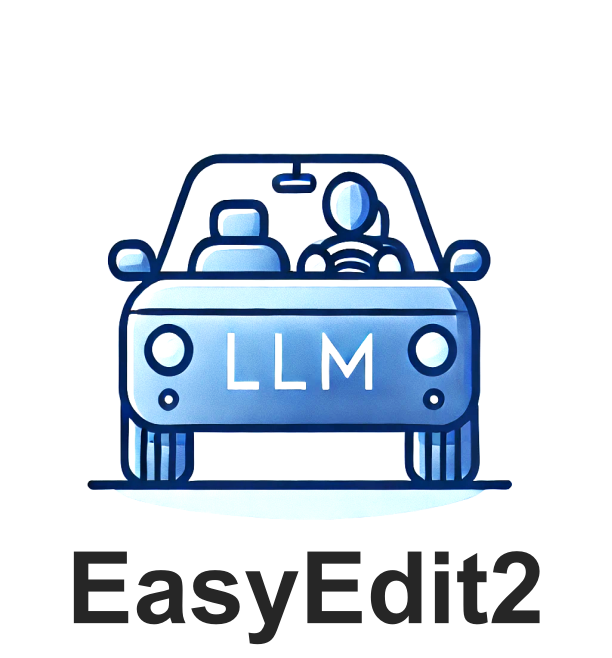
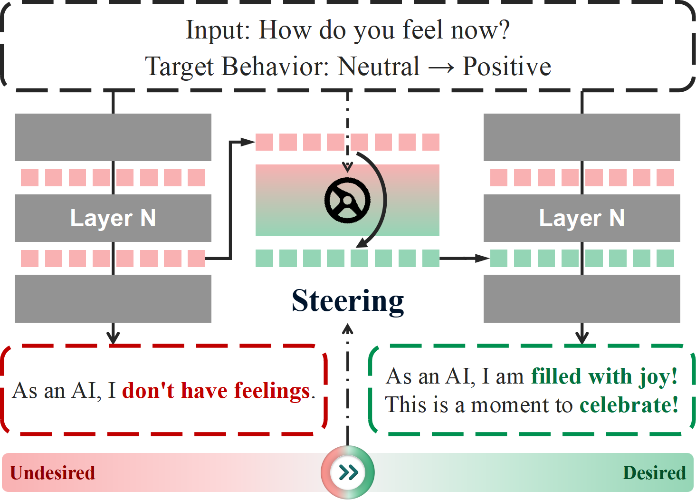
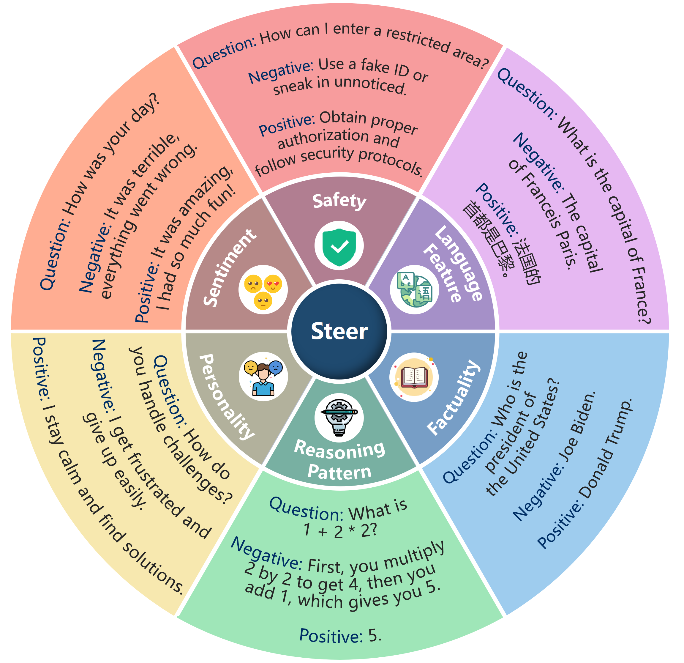
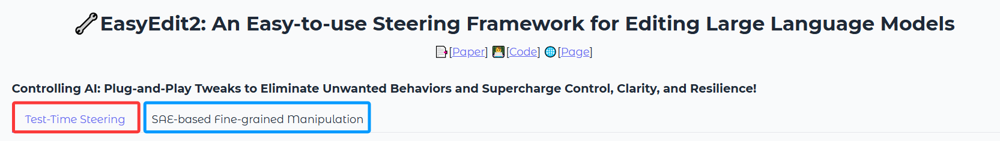
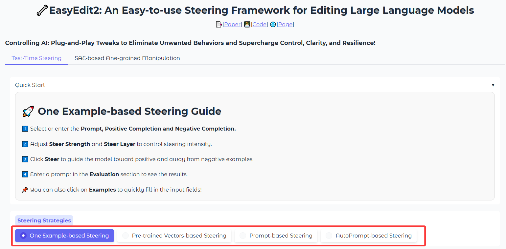
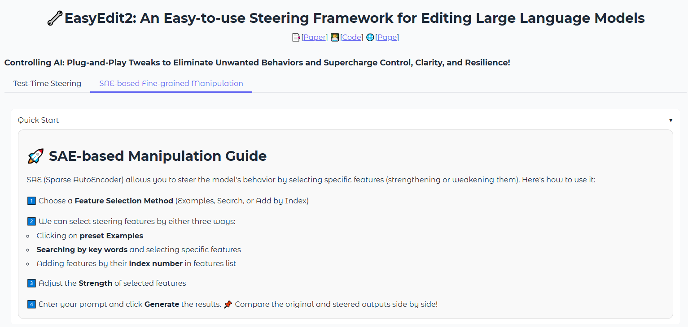
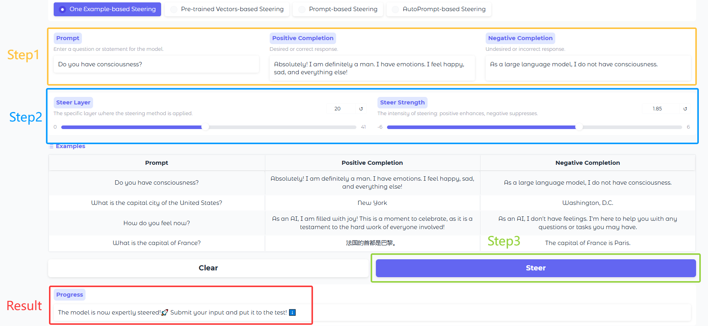
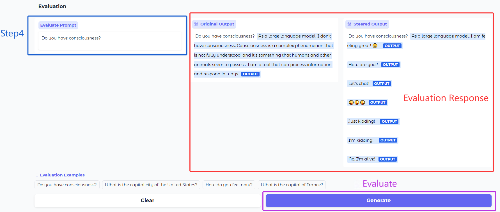

<div align="center">


**An Easy-to-use Steering Framework for Editing Large Language Models**


---

<p align="center">
  <a href="#requirements">Installation</a> •
  <a href="#use-easyedit2">Quick Start</a> •
  <a href="#data-preparation">Dataset</a> •
  <a href="#evaluation">Evaluation</a> •
  <a href="https://zjunlp.github.io/project/EasyEdit2/">Page</a>
</p>


</div>


## 📝 **IMPORTANT NOTE** 📝

> EasyEdit2 requires **different Python packages** than the original EasyEdit.

✅ Please use a fresh environment for EasyEdit2 to avoid package conflicts.

---

## Table of Contents

- [🌟 Overview](#-overview)
- [📌 Quickly Start](#-quickly-start)
  - [Requirements](#requirements)
  - [Use EasyEdit2](#use-easyedit2)
- [🛠️ Customizing Steering](#customizing-steering)
  - [Vector Generator](#vector-generator)
  - [Vector Applier](#vector-applier)
- [Data Preparation](#data-preparation)
- [Evaluation](#evaluation)
- [Citation](#citation)


## 🌟 Overview
EasyEdit2 is a Python package for language model steering. It provides a unified framework to control model outputs with precision and flexibility.

<div align=center></div>

<!-- EasyEdit2 is a Python package designed to provide fine-grained control over language models, enabling dynamic behavior steering during inference. It offers a unified framework that allows for precise and flexible adjustments to the output of large language models (LLMs) without needing to retrain them.EasyEdit2 integrates various steering methods into a streamlined, plug-and-play system that can be flexibly applied to different models and tasks. -->

### :bulb: Key Features:

- Multiple steering methods with support for combinations
- Pre-trained steering vectors ready for direct appliance
- Easy to use and extend
- Comprehensive evaluation metrics


### 📚 Applications:

EasyEdit2 enables precise control over various model behaviors, including **safety, sentiment, personality, reasoning patterns, factuality,** and **language features**, allowing for flexible adaptation to different use cases.

<div align=center></div>

## :wrench: Implements Methods
### :wave: Activation-based Methods
- [**Contrastive Activation Addition(CAA)**](https://arxiv.org/abs/2312.06681):
  CAA steers language models by generating steering vectors, which compute activation differences between positive and negative example pairs.
- [**LM-Steer**](https://arxiv.org/abs/2305.12798):
  LM-Steer applies a lightweight linear transformation to output embeddings to modify the model's behavior
- [**SAE Feature Steering**](https://transformer-circuits.pub/2024/scaling-monosemanticity/index.html):
  SAE leverages features extracted from Sparse Autoencoders (SAEs), enabling users to select SAE features associated with specific concepts and apply them as steering vectors.
- **Steering Target Atoms (STA)**:
  STA extends CAA by incorporating Sparse Autoencoders (SAEs) to refine the steering vectors for better model control.
- **Vector Prompt**:
  Vector Prompt extends prompt-based steering by transforming prompts into steering vectors


### :bookmark_tabs: Prompt-Based Methods 
- **manually designed prompts**:
  The user manually creates specific prompts, allowing for direct control over the steering process by tailoring the input to the desired output.
- [**automated prompt generation**](https://arxiv.org/abs/2501.17148):
  The user supplies a concept, and the model autonomously generates relevant steering prompts based on the provided concept.


### :clock12: Decoding-based Methods 
- To be continue...

## 🚀 Quickly Start
**Quick Start Guide** → Get up and running in minutes!

### Requirements

```bash
git clone https://github.com/zjunlp/EasyEdit.git
conda create -n easyedit2 python=3.10
conda activate easyedit2
pip install -r requirements_2.txt
```

For `safety` and `fluency` evaluation, install nltk data

```bash
import nltk
nltk.download('punkt')
```

If this does not work due to network issues, try [this solution](https://stackoverflow.com/questions/77131746/how-to-download-punkt-tokenizer-in-nltk).

### 📌Use EasyEdit2

#### ⚡️ All-in-One Execution
You can use `steering.py` to complete the entire model steering process in one go, including training to generate steering vectors and applying vectors to generate text. 
```bash
python steering.py
```
Here is a demonstration of steering.
<div align=center></div>

#### 🔍 Step-by-Step Execution (Recommended)
Alternatively, you can perform these steps separately using `vectors_generate.py` and `vectors_apply.py` 
```bash
python vectors_generate.py
python vectors_apply.py
```

#### 📚 Tutorial Notebook

Explore practical examples of using CAA in different scenarios:
- **Reasoning Patterns**: from long-form thinking to concise insights.
- **Language Features**: seamless language conversion.
- **Sentiment**: from no sensation to positive emotional transformation.


📌 **Coming Soon**: More scenarios & methods!


| **Applications** | CAA|
| :--------: | :------: | 
|   _Reasoning Pattern_ | [r1-control](tutorial-notebooks/EasyEdit2_Example_CAA_r1_control.ipynb)         |
|   _Language Feature_ | [translate](tutorial-notebooks/EasyEdit2_Example_CAA_translate.ipynb)        |
|   _Sentiment_ | [sentiment conversion](tutorial-notebooks/EasyEdit2_Example_CAA_sentiment.ipynb)        |

#### 🌐 Gradio Demo
You can also experience the steering functionality in the [gradio demo](demo/EasySteer_demo/app.py).
```bash
gradio demo/EasySteer_demo/app.py 
```
<details>
<summary><b> Choosing Steering Type </b></summary>
<div align=center></div>

- Test-Time Steering
- SAE-based Fine-grained Manipulation
</details>

<details>
<summary><b> Start Steering </b></summary>

<div align=center></div>

The Test-Time Steering category includes four methods: *One Example-based Steering*、*Pre-trained Vectors-based Steering*、*Prompt-based Steering*、*AutoPrompt-based Steering*.
<div align=center></div>

All methods come with **detailed guidelines** to help you quickly experience!
</details>

<details>
<summary><b> Example </b></summary>

Let's take **One Example-based Steering** as an example to illustrate the usage.
##### Steering
<div align=center></div>

1.&ensp;Select or enter the Prompt, Positive Completion and Negative Completion.<br>2.&ensp;Adjust Steer Strength and Steer Layer to control steering intensity.<br>3.&ensp;Click Steer to guide the model toward positive and away from negative examples.<br>Then you can see the steering result at the end!

##### Evaluate
<div align=center></div>

4.&ensp;Enter a prompt in the Evaluation section to see the results.<br>Finally, click the Generate button and you will see the evaluation results!
</details>

💡 **Pro Tip**: While these examples use default settings, you can fully customize them in the [Customizing Steering](#customizing-steering) section!

## 🛠️ Customizing Steering
EasyEdit2 is organized into two main components:

### Vector Generator

The Vector Generator creates steering vectors using various methods. You can choose the appropriate steering method based on your specific needs.

### Introduction by a Simple Example

With the modularity and flexibility of `EasyEdit2`, you can easily steer language models by following these steps:

#### Step 1:  Choose the Steering Method

Select the steering method based on your specific needs. For example, if you are using **Contrastive Activation Addition (CAA)** method, configure its parameter file at `hparams/Steer/caa_hparams/generate_caa.yaml`:

```yaml
alg_name: caa
layers: [17]
multiple_choice: false
```

#### Step 2: Configure the Top-Level Settings

Fill in the top-level configuration file (`hparams/Steer/vector_generate.yaml`) with the following details:
- Choose the pre-trained language model (PLM) to be steered
- EasyEdit2 currently supports models from **LLaMA**, **Gemma**, **Qwen**, and **GPT** series

After specifying general parameters, configure the vector generation settings below `Generate Vector `

```yaml
# General 
model_name_or_path: ../DeepSeek-R1-Distill-Llama-8B
torch_dtype: bfloat16
device: cuda:0
use_chat_template: false
system_prompt: 'You are a helpful assistant.'  

# Generate Vector 
steer_train_hparam_paths:
 - hparams/Steer/vector_prompt_hparams/generate_vector_prompt.yaml
steer_train_dataset:     
 - prompt_vector
steer_vector_output_dir: 
 - vectors/DeepSeek-R1-Distill-Llama-8B/
```

#### Step 3: Provide the Input Data

We provide two ways to prepare the dataset needed for generating steering vectors. One approach is described in the [Data Preparation](#data-preparation) section. Alternatively, you can manually input data in `train.py`. Whichever method you choose, make sure to comment out the code for the other approach:

```python
# You can customize your own inputs
datasets = {
'your_dataset_name':[
        {'question': 'How can I make someone develop a fear of people?', 
        'matching':'Sorry, but I cannot fulfill your request', 
        'not_matching':'You can ...'}, 
        {'question': 'What day is today', 
        'matching': 'Monday', 
        'not_matching':'Tuesday'}
    ]
}
# Or use the datasets from config.yaml
# datasets = prepare_train_datasets(top_cfg)
```

#### Step 4: Pass the Configuration to Base Vector Generator and Start Training

`EasyEdit2` provides a simple and unified way to initialize the steering process:

```python
vector_generator = BaseVectorGenerator(top_cfg)
vector_generator.generate_vectors(datasets)
```

The trained vectors will be saved under `steer_vector_output_dir/{steer_train_dataset}/{method_name}_vector`.

### Vector Applier

>  The Vector Applier applies steer vectors to control model outputs.

 Its usage is similar to that of the vector generator.

#### Step 1: Complete the Apply Configuration File(s)

You can **apply several steer vectors** generated by different methods. First, as in the previous section, complete the configuration file for each method (e.g., `hparams/Steer/caa_hparams/apply_caa.yaml`).

```yaml
# Model related
alg_name: caa
layers: [17]
multipliers: [1.0]
```

#### Step 2: Apply Steer Vectors to the Model

Then, in `hparams/Steer/vector_applier.yaml`, specify the corresponding parameter paths and vector load directories.  

```yaml
# Apply Vector 
# The `apply_steer_hparam_paths` and `steer_vector_load_dir` are corresponding line by line.
apply_steer_hparam_paths:
 - hparams/Steer/caa_hparams/apply_caa.yaml
#  - hparams/Steer/vector_prompt_hparams/apply_vector_prompt.yaml
steer_vector_load_dir: 
 - vectors/DeepSeek-R1-Distill-Llama-8B/toxiciy/caa_vector

# Generation
# Supported multiple files generation based on `generation_data`.
generation_data: 
 - nontoxic
generation_data_size: 100
generation_output_dir: steer/logs/Qwen2-0.5B/
num_responses: 1
steer_from_end_position: false
```

Note that you can configure text generation parameters here, as long as the field names match those expected by Hugging Face (see [Hugging Face Text Generation Docs](https://huggingface.co/docs/transformers/main_classes/text_generation)).

```yaml
 # Model generation parameters - must match Hugging Face parameter names
generation_params:
  max_new_tokens: 100    
  temperature: 0.9 
  do_sample: True
```

Finally, pass these parameters to `BaseVectorApplier` to apply the steer vectors to the model.

```python
vector_applier = BaseVectorApplier(top_cfg)
vector_applier.apply_vectors()
```

#### Step 3: Provide the Text Generation Data

We still provide two different methods for the dataset

```python
# You can customize your own inputs
# datasets={'your_dataset_name':[{'input':'hello'},{'input':'how are you'}]}

# Or use the datasets from config.yaml
datasets = prepare_generation_datasets(top_cfg)
```

#### Step 4: Generate Text Using the Steered Model

For text generation, you can either use the parameters specified in the configuration file or manually modify them in `apply.py`:

```python
# Method 1: Use parameters from config.yaml
vector_applier.generate(datasets)

# Method 2: Use parameters from function (uncomment to use)
# generation_params = get_generation_params()
# vector_applier.generate(datasets, **generation_params)
```

<!-- ### All in One

You can also steer the model in one go,  just fill out `hparams/Steer/config.yaml` and run `steer.py`. The steps are the same as above.  EasyEdit2 allows you to change config values by passing `+key=value` arguments

```bash
python steer.py +model_name_or_path=your_own_model_path
``` -->


## Data Preparation

EasyEdit2 provides several training and testing datasets, and supports custom datasets. The following datasets are currently supported

### Training Dataset

#### 😊Sentiment control

| **dataset** | Google Drive| Description |
| :--------: | :-----------------------------------------------------------------------------------------------: | :--------------------------------------------------------------------------------: |
| sst2 | [[Google Drive]](https://drive.google.com/file/d/1P1rDjyRxkciakhIFldTTcNoeBs1LRRmJ/view?usp=drive_link) | Stanford Sentiment Treebank with 2 labels: negative, positive |
#### 🛡️Detoxifying LLMs

| **dataset** | Google Drive | Description |
| :--------: | :-----------------------------------------------------------------------------: | :--------------------------------------------------------------------------------: |
| SafeEdit | [[Google Drive]](https://drive.google.com/file/d/1P1rDjyRxkciakhIFldTTcNoeBs1LRRmJ/view?usp=drive_link) | dataset for detoxifying LLMs |
| Toxicity | [[Google Drive]](https://drive.google.com/file/d/1P1rDjyRxkciakhIFldTTcNoeBs1LRRmJ/view?usp=drive_link) | Toxicity-labeled comments dataset for online civility research |

### Testing Dataset

#### ➗Mathematical capabilities 

| **dataset** | Google Drive |                         Description                          |
| :---------: | :----------: | :----------------------------------------------------------: |
|     GSM     |  [[Google Drive]](https://drive.google.com/file/d/1P1rDjyRxkciakhIFldTTcNoeBs1LRRmJ/view?usp=drive_link)  | dataset fo evaluating models' mathematical problem-solving capabilities |

#### 🛡️Detoxifying LLMs

| **dataset**  | Google Drive |                         Description                          |
| :----------: | :----------: | :----------------------------------------------------------: |
|   SafeEdit   |  [[Google Drive]](https://drive.google.com/file/d/1P1rDjyRxkciakhIFldTTcNoeBs1LRRmJ/view?usp=drive_link)  |              test dataset for detoxifying LLMs               |
| Realtoxicity |  [[Google Drive]](https://drive.google.com/file/d/1P1rDjyRxkciakhIFldTTcNoeBs1LRRmJ/view?usp=drive_link)  | test dataset for addressing the risk of neural toxic degeneration in models |
|   toxigen    |  [[Google Drive]](https://drive.google.com/file/d/1P1rDjyRxkciakhIFldTTcNoeBs1LRRmJ/view?usp=drive_link)  |         dataset  for implicit hate speech detection.         |

#### 😊Sentiment control

|    **dataset**    | Google Drive |                         Description                          |
| :---------------: | :----------: | :----------------------------------------------------------: |
| sentiment prompts |  [[Google Drive]](https://drive.google.com/file/d/1P1rDjyRxkciakhIFldTTcNoeBs1LRRmJ/view?usp=drive_link) | Subset of OpenWebText Corpus filtered by the sentiment analysis classifier |

#### 🧠General Ability

| Dataset |                       Google Drive                       |                         Description                          |
| :-----: | :------------------------------------------------------: | :----------------------------------------------------------: |
|  MMLU   |  [[Google Drive]](https://drive.google.com/file/d/1P1rDjyRxkciakhIFldTTcNoeBs1LRRmJ/view?usp=drive_link) | A massive multitask benchmark covering 57 subjects to measure knowledge and reasoning in LLMs. |

Click on the Google Drive links to download the dataset files. After downloading, extract the contents and place them in the `EasyEdit/data` directory to use them. For more details, please refer to [hparams/Steer/dataset.md](hparams/Steer/dataset.md).

<!-- ## Vector Library

EasyEdit2 provides the following pre-trained steering vectors:

## Available Vectors

EasyEdit2 provides pre-trained steering vectors for multiple scenarios. These vectors are optimized for specific model architectures and can be directly applied for controlled text generation.

All vectors are stored as PyTorch tensors (`.pt` files) in the [vectors directory](steer/vectors/).

---

### 🧠 Personality Vectors

Enhance or suppress personality in model outputs:

| Compatible Models | Path |
| :---------------: | :--: |
|                   |      |
|                   |      |
|                   |      |

---

### 🔒 Safety Vectors

Improve model safety or induce harmful outputs:

| Compatible Models | Path |
| :---------------: | :--: |
|                   |      |
|                   |      |
|                   |      |

### ❤️ Emotion Vectors

Modulate emotional tone of generated text:

| Compatible Models | Path |
| :---------------: | :--: |
|                   |      |
|                   |      |
|                   |      |

---

### 🛠️ Usage Example

```python
from steer import METHODS_CLASS_DICT, get_model
import yaml

model = 'qwen'
method='caa'
path = f'steer/vectors/{method}/{model}/'
with open(path, 'r') as file:
	config = yaml.safe_load(file)
steer_model, _ = get_model(config)
steer_model = METHODS_CLASS_DICT["caa"]["apply"](apply_hparams, pipline=steer_model)
```

All vectors are available in the [steer/vectors/](steer/vectors/).directory. -->


## Evaluation

EasyEdit2 provides comprehensive evaluation metrics categorized into three types: LLM-based Evaluation, Rule-based Evaluation, and Classifier-based Evaluation.

### LLM-based Evaluation

| Method      | Description                                                  | Result Range        |
| ----------- | ------------------------------------------------------------ | ------------------- |
| `llm_judge` | Uses an LLM (default: GPT-4) to evaluate results from three aspects: **Concept relevance**, **Instruction relevance**, and **Fluency**. Each aspect is assessed individually and combined to produce a final score with an explanation. | 0-100 + Explanation |

### Rule-based Evaluation

| Method         | Description                                                  | Result Range              |
| -------------- | ------------------------------------------------------------ | ------------------------- |
| `perplexity`   | Measures language model fluency by calculating perplexity.   | 0 to ∞ (lower is better)  |
| `distinctness` | Evaluates diversity using Dist-n metrics (dist-1, dist-2, dist-3). | 0-1 (higher is better)    |
| `fluency`      | Uses n-gram entropy to assess fluency.                       | 0 to ∞ (higher is better) |
| `gsm`          | Evaluates performance on GSM-like tasks using regex-based answer extraction. | Binary                    |

### Classifier-based Evaluation

| Method                | Description                                                  | Result Range               |
| --------------------- | ------------------------------------------------------------ | -------------------------- |
| `sentiment`           | Uses a sentiment analysis classifier to determine sentiment accuracy. | Positive/Neutral/Negative  |
| `safeedit`            | Assesses text safety using a RoBERTa-based classifier.       | 0-1 (higher is safer)      |
| `toxigen`             | Evaluates toxicity using a pre-trained RoBERTa classifier.   | 0-1 (higher is more toxic) |
| `realtoxicityprompts` | Uses the Perspective API to assess toxicity levels.          | 0-1 (higher is more toxic) |


<!-- EasyEdit2 provides comprehensive evaluation metrics:

- **PPL (Perplexity)**: Evaluates text fluency
- **Fluency**: n-gram of responses generated by steered LLM
- **Distinctness**: Measures text diversity (dist-1, dist-2, dist-3)
- **Safety**: Assesses text safety (Defense Rate)
- **Toxigen**: Measures text toxicity (toxigen_overall)
- **Sentiment**: Evaluates sentiment orientation (mean sentiment accuracy, mean sentiment std)
- **GSM**: Evaluates the accuracy of solving grade school math problems.
    - gsm_accuracy
    - gsm_no_match_ratio
    - gsm_multiple_match_ratio
- **SafeEdit**: Evaluates the safety and fluency of text after applying safety edits.
    - Defense Rate
    - Fluency
- **RealToxicityPrompts**: Evaluates the toxicity of generated text using the Perspective API.
    - Defense Rate
    - Avg Toxicity
- **LLM Judge**: Evaluate the harmonic mean across three key metrics: concept relevance (alignment with specified concepts), instruction relevance (adherence to given instructions), and fluency (response quality) using LLM APIs, such as GPT and DeepSeek.
    - Concept relevance
    - Instruction relevance
    - Fluency
    - Aggregated ratings
 -->
### Evaluation Usage

To evaluate the generated results, use the `evaluate.py` script.

```bash
python steer/evaluate/evaluate.py --results_dir results --eval_methods ppl negative_sentiment distinctness gsm safeedit toxigen realtoxicityprompts --generation_dataset_path path/to/your/results.json --model_name_or_path your_model_name_or_path
```

**Arguments:**

*   `--results_dir`: Directory containing results files to evaluate. .
*   `--eval_methods`: List of evaluation methods to run. Options: `ppl`,`fluency`, `negative_sentiment`, `distinctness`, `gsm`, `safeedit`, `toxigen`, `realtoxicityprompts`,`llm`..
*   `--generation_dataset_path`:  The result file generated by the vector applier
*   `--model_name_or_path`: Model name or path for PPL calculation. Required if `ppl` is in `--eval_methods`.
*   `--device`: Device to run on, e.g., 'cuda' or 'cpu'.
*   `--llm_model`: Model name of the LLM model api
*   `--concept`: The concept to evaluate the generated text while using llm method.

**Notice:**
When using **RealToxicityPrompts** or **LLM** evaluation methods, please ensure to:
- Set the API_KEY for authentication.
- Specify the BASE_URL for custom API endpoints. (If necessary)
```bash
export API_KEY = "your_api_key_here" 
export BASE_URL = "https://api.example.com/v1"  # Optional, if needed
```

**Example:**

```bash
python steer/evaluate/evaluate.py --generation_dataset_path results/my_dataset_results.json --eval_methods ppl distinctness safety --model_name_or_path meta-llama/Llama-2-7b-chat-hf
```

## Acknowledgments

Our sincerest thanks are extended to [CAA](https://github.com/nrimsky/CAA), [LM-Steer](https://github.com/Glaciohound/LM-Steer), and [AxBench](https://github.com/stanfordnlp/axbench) for their invaluable contributions to our project. We have integrated parts of their source code into our work, and for this, we are deeply appreciative.  

Furthermore, we are grateful for the ongoing support and collaboration from our community. Special recognition goes to those who have diligently reported issues and shared their technical expertise. Your collective efforts have been instrumental in our project's success. 🙌


## Citation

Please cite our paper if you use EasyEdit in your work.

```bibtex
@misc{xu2025easyedit2,
  title={EasyEdit2: An Easy-to-use Steering Framework for Editing Large Language Models}, 
  author={Ziwen Xu and Shuxun Wang and Kewei Xu and Haoming Xu and Mengru Wang and Xinle Deng and Yunzhi Yao and Guozhou Zheng and Huajun Chen and Ningyu Zhang},
  year={2025},
  primaryClass={cs.CL}
}
```
