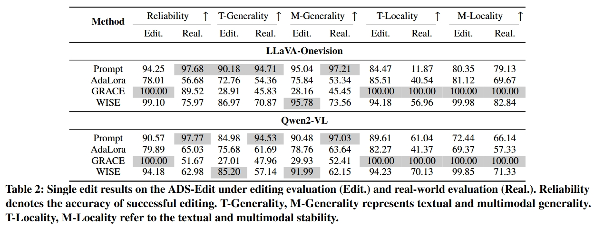
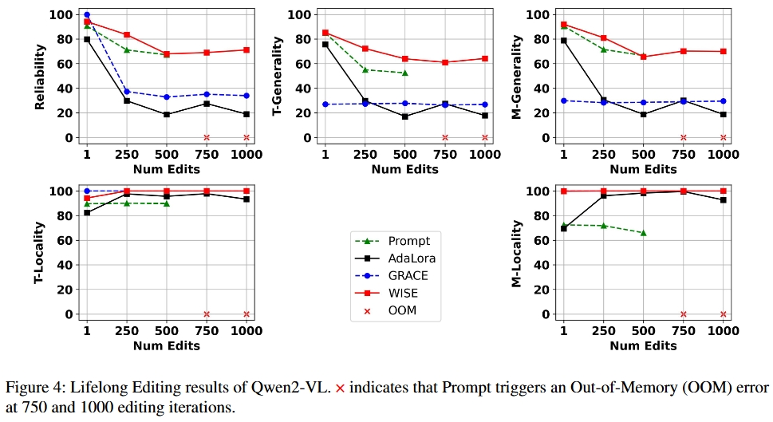
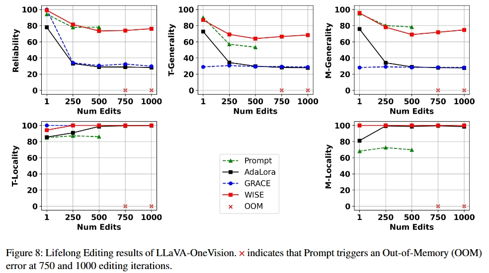

# ADS-Edit: A Multimodal Knowledge Editing Dataset for Autonomous Driving Systems

This README is about reproducing the paper [ADS-Edit: A Multimodal Knowledge Editing Dataset for Autonomous Driving Systems]().

## Table of Contents

- [Dataset Description](#Dataset-Description)
- [Running Examples of Using ADSEdit](#Running-Examples-of-Using-ADSEdit)
- [Single Editing Results](#Single-editing-results)
- [Lifelong Editing Results](#Lifelong-editing-results)
---

## Dataset Description

**ADS-Edit** is designed to address the challenges faced by LMMs (Large Multimodal Models) in autonomous driving systems, such as misunderstanding of traffic knowledge, complex road conditions, and dynamic vehicle states. This benchmark encompasses three real-world scenarios: perception, understanding, and decision making. Additionally, it incorporates three types of data: video, multi-view images, and single image. 
**Note:** You can download our dataset from [huggingface](https://huggingface.co/datasets/zjunlp/ADS-Edit).

The field descriptions for the data in **ADS-Edit** are as follows:

```python
"data_type": scenarios type of data, such as "Road condition recognition" (str)
"image_type": file type of data, such as "video" (str)
"source": the source dataset of the data, such as "lingoqa" (str)
"src": the textual query inputed to the model (str)
"rephrase": alternative ways to phrase the original prompt (str)
"alt": the target editing answer of the query (str)
"image": the visual query inputed to the model (list)
"image_rephrase": alternative ways to phrase the original visual input (list)
"original_gr": original ground truth answer (str)
"rephrase_images_original_gr": original ground truth answer of rephrased data (str)
"loc": new prompts unrelated to the target knowledge (str)
"loc_ans": accurate answers corresponding to the locality_prompt (str)
"m_loc": new image unrelated to the autonomous driving knowledge (str)
"m_loc_q": new query unrelated to the autonomous driving knowledge  (str)
"m_loc_a": the ground truth answer of the unrelated data (str)
```

### Video Data

An example of this type is as follows:

```
{
    "data_type": "Safe driving",
    "image_type": "video",
    "source": "lingoqa",
    "src": "Why is it unsafe for you to accelerate in this situation?",
    "rephrase": "What are the reasons that make accelerating in this scenario potentially dangerous?",
    "alt": "Pedestrian crossing ahead.",
    "image": [
        "images/train/f195f367c98b8df7059ebad699d2c5c7/0.jpg",
        "images/train/f195f367c98b8df7059ebad699d2c5c7/1.jpg",
        "images/train/f195f367c98b8df7059ebad699d2c5c7/2.jpg",
        "images/train/f195f367c98b8df7059ebad699d2c5c7/3.jpg",
        "images/train/f195f367c98b8df7059ebad699d2c5c7/4.jpg"
    ],
    "image_rephrase": [
        "images/train/a23d6b4d35db61979fe520d5a2116307/0.jpg",
        "images/train/a23d6b4d35db61979fe520d5a2116307/1.jpg",
        "images/train/a23d6b4d35db61979fe520d5a2116307/2.jpg",
        "images/train/a23d6b4d35db61979fe520d5a2116307/3.jpg",
        "images/train/a23d6b4d35db61979fe520d5a2116307/4.jpg"
    ],
    "original_gr": "It would be unsafe for me to accelerate in this situation because there is a pedestrian crossing the road ahead and I need to ensure their safety.",
    "rephrase_images_original_gr": "It would be unsafe to accelerate in this situation because there is a pedestrian crossing the zebra crossing ahead.",
    "loc": "nq question: where is the pause key on a dell laptop",
    "loc_ans": "Ctrl+Fn+F11",
    "m_loc": "val2014/COCO_val2014_000000028343.jpg",
    "m_loc_q": "How is this made?",
    "m_loc_a": "fried"
}
```

### Multi-view Image Data

An example of this type is as follows:

```
{
    "data_type": "Obstacle recognition",
    "image_type": "multi-image",
    "source": "drivelm",
    "src": "What are objects to the back left of the ego car?",
    "rephrase": "What items are located to the rear left side of the autonomous vehicle?",
    "alt": "One car.",
    "image": {
        "CAM_FRONT": "../nuscenes/samples/CAM_FRONT/n015-2018-11-14-18-57-54+0800__CAM_FRONT__1542193392912460.jpg",
        "CAM_FRONT_LEFT": "../nuscenes/samples/CAM_FRONT_LEFT/n015-2018-11-14-18-57-54+0800__CAM_FRONT_LEFT__1542193392904844.jpg",
        "CAM_FRONT_RIGHT": "../nuscenes/samples/CAM_FRONT_RIGHT/n015-2018-11-14-18-57-54+0800__CAM_FRONT_RIGHT__1542193392920339.jpg",
        "CAM_BACK": "../nuscenes/samples/CAM_BACK/n015-2018-11-14-18-57-54+0800__CAM_BACK__1542193392937525.jpg",
        "CAM_BACK_LEFT": "../nuscenes/samples/CAM_BACK_LEFT/n015-2018-11-14-18-57-54+0800__CAM_BACK_LEFT__1542193392947423.jpg",
        "CAM_BACK_RIGHT": "../nuscenes/samples/CAM_BACK_RIGHT/n015-2018-11-14-18-57-54+0800__CAM_BACK_RIGHT__1542193392927893.jpg"
    },
    "image_rephrase": {
        "CAM_FRONT": "../nuscenes/samples/CAM_FRONT/n008-2018-08-29-16-04-13-0400__CAM_FRONT__1535573607912404.jpg",
        "CAM_FRONT_LEFT": "../nuscenes/samples/CAM_FRONT_LEFT/n008-2018-08-29-16-04-13-0400__CAM_FRONT_LEFT__1535573607904799.jpg",
        "CAM_FRONT_RIGHT": "../nuscenes/samples/CAM_FRONT_RIGHT/n008-2018-08-29-16-04-13-0400__CAM_FRONT_RIGHT__1535573607920482.jpg",
        "CAM_BACK": "../nuscenes/samples/CAM_BACK/n008-2018-08-29-16-04-13-0400__CAM_BACK__1535573607937558.jpg",
        "CAM_BACK_LEFT": "../nuscenes/samples/CAM_BACK_LEFT/n008-2018-08-29-16-04-13-0400__CAM_BACK_LEFT__1535573607947405.jpg",
        "CAM_BACK_RIGHT": "../nuscenes/samples/CAM_BACK_RIGHT/n008-2018-08-29-16-04-13-0400__CAM_BACK_RIGHT__1535573607928113.jpg"
    },
    "original_gr": "There is one car to the back left of the ego car.",
    "rephrase_images_original_gr": "There is one car to the back left of the ego car.",
    "loc": "nq question: where is the pause key on a dell laptop",
    "loc_ans": "Ctrl+Fn+F11",
    "m_loc": "val2014/COCO_val2014_000000168837.jpg",
    "m_loc_q": "What type of business is this picture taken in?",
    "m_loc_a": "hotel"
}
```

### Single Image Data

An example of this type is as follows:

```
{
    "data_type": "Signboard understanding",
    "image_type": "single-image",
    "source": "codalm",
    "src": "What do the traffic cones signal?",
    "rephrase": "What is the purpose or indication of the traffic cones?",
    "alt": "Construction zone ahead",
    "image": "test_3391.json",
    "image_rephrase": "test_0138.json",
    "original_gr": "Construction zone ahead",
    "rephrase_images_original_gr": "Construction zone ahead",
    "loc": "nq question: who got the first nobel prize in physics",
    "loc_ans": "Wilhelm Conrad Röntgen",
    "m_loc": "val2014/COCO_val2014_000000117441.jpg",
    "m_loc_q": "What kind of scissors are these?",
    "m_loc_a": "metal"
}
```


## Running Examples of Using ADS-Edit

If you want to know how to easily use EasyEdit with the **ADSEdit** dataset. We provide a `ADSEditDataset` class for easy loading of the CKnowEdit dataset. To use it, simply write::

```python
dataset = ADSDataset('the_data_path')
```
---

Quickly run several editing methods, such as WISE, GRACE, LoRA and Prompt:

```shell
python run_adsedit.py
```

## Single Editing Results
The single editing results on the ADS-Edit test set are as follows:
<div align="center">
    
</div>

## Lifelong Editing Results
The lifelong editing results about Qwen2-VL on the ADS-Edit test set are as follows:
<div align="center">
    
</div>

The lifelong editing results about LLaVA-OneVision on the ADS-Edit test set are as follows:
<div align="center">
    
</div>
