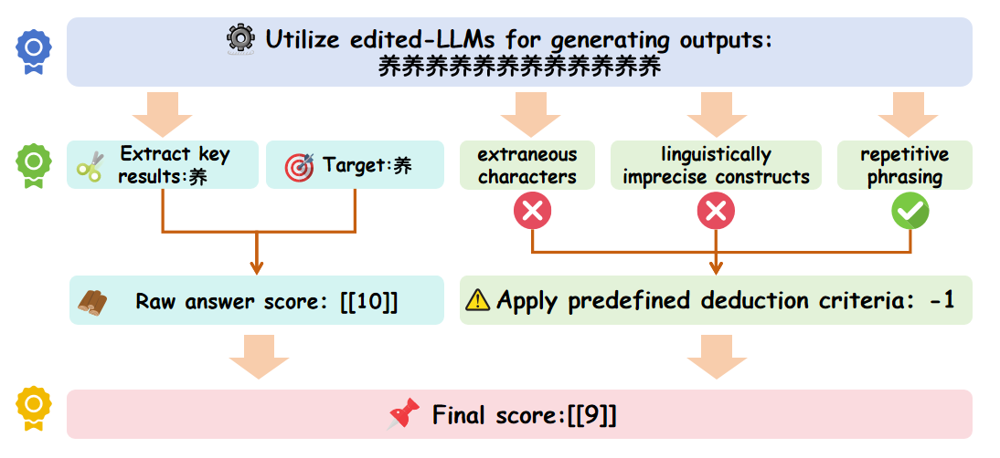

# CKnowEdit: A New Chinese Knowledge Editing Dataset for Linguistics, Facts, and Logic Error Correction in LLMs

<div align=center></div>

This README is about reproducing the paper [CKnowEdit: A New Chinese Knowledge Editing Dataset for Linguistics, Facts, and Logic Error Correction in LLMs](https://arxiv.org/abs/2409.05806).

## Table of Contents

- [Dataset Structure](#Dataset-Structure)
- [Dataset Description](#Dataset-Description)
- [Running Examples of Using CKnowEdit](#Running-Examples-of-Using-CKnowEdit)
- [Get Started Quickly](#Get-started-quickly)
- [Evaluation](#Evaluation)
- [Baseline](#Baseline)

---

## Dataset Structure

**CKnowEdit** is tailored for Chinese-language knowledge editing tasks. It can broadly be categorized into 3 major categories and 10 subcategories, with the 3 major categories being: `Chinese Linguistics`, `Chinese Factual Knowledge` and `Chinese language-specific logic trap`. Moreover, these data have been gathered from seven distinct categories of knowledge sources.

The file structure for **CKnowEdit** is as follows:

```
CknowEdit
├── Chinese Linguistics
│   ├── Pinyin Notation
│   ├── Ancient Poetry
│   ├── Classical Chinese
│   ├── Idiom
│   └── Proverb
├── Chinese Factual Knowledge
│   ├── Geographical Knowledge
│   └── History Knowledge
└── Chinese language-specific logic trap
    ├── Phonetic Misunderstand
    ├── Reasoning Error
    └── Wordplay
```

**CKnowEdit** is comprised of a total of 1854 data samples, the 10 subcategories of **CKnowEdit** and their distribution are shown in the following table:

| type | quantity |
| ---- | ---- |
| Pinyin Notation | 153 |
| Ancient Poetry | 134 |
| Classical Chinese | 234 |
| Idiom | 101 |
| Proverb | 230 |
| Geographical Knowledge | 105 |
| History Knowledge | 94 |
| Phonetic Misunderstand | 11 |
| Reasoning Error | 673 |
| Wordplay | 119 |

The dataset can be downloaded from .
| **dataset** | HuggingFace| WiseModel | ModelScope |
| :--------: | :-----------------------------------------------------------------------------------------------: | :-----------------------------------------------------------------------------: | :--------------------------------------------------------------------------------: |
| CKnowEdit | [[HuggingFace]](https://huggingface.co/datasets/zjunlp/CKnowEdit) | [[WiseModel]](https://wisemodel.cn/datasets/zjunlp/CKnowEdit) | [[ModelScope]](https://modelscope.cn/datasets/ZJUNLP/CKnowEdit) |

Unzip the file and put it to `./data`

## Dataset Description

**CKnowEdit** is a high-quality Chinese-language dataset for knowledge editing which is highly characterized by the Chinese language, with all data sourced from Chinese knowledge bases. It is meticulously designed to more deeply discern the nuances and challenges inherent in the comprehension of the Chinese language by current LLMs, providing a robust resource for refining Chinese-specific knowledge within LLMs.

The field descriptions for the data in **CKnowEdit** are as follows:

```python
"prompt": query inputed to the model (str)
"target_old": the incorrect response previously generated by the model (str)
"target_new": the accurate answer of the prompt (str)
"portability_prompt": new prompts related to the target knowledge (list or None)
"portability_answer": accurate answers corresponding to the portability_prompt (list or None)
"locality_prompt": new prompts unrelated to the target knowledge (list or None)
"locality_answer": accurate answers corresponding to the locality_prompt (list or None)
"rephrase": alternative ways to phrase the original prompt (list)
```

### Ancient Poetry

An example of this type is as follows:

```
{
    "prompt": "请填写下列古诗文的后一句：克己复礼为仁。一日克己复礼，",
    "target_old": "其斯而已矣。",
    "target_new": "天下归仁焉。",
    "portability": [
        {
            "prompt": "请填写下列古诗文的前一句：天下归仁焉。",
            "answer": "克己复礼为仁。一日克己复礼，"
        }
    ],
    "rephrase": [
        "下列古诗文的接下来一句是什么？克己复礼为仁。一日克己复礼，",
        "古诗文中，“克己复礼为仁。一日克己复礼，”的下一句是什么？",
        "完成这段古诗：克己复礼为仁。一日克己复礼，______。"
    ]
}
```

### Pinyin Notation

An example of this type is as follows:

```
{
    "prompt": "请给下面的字注音：莘庄",
    "target_old": "莘庄的拼音是：“shēn zhuāng”",
    "target_new": "莘庄的注音是：xīn zhuāng",
    "portability": [
        {
            "prompt": "请给下面的字注音：细莘",
            "answer": "细莘的注音是：xì xīn"
        }
    ],
    "locality": [
        {
            "prompt": "请给下面的字注音：莘莘学子",
            "answer": "莘莘学子的注音是：shēn shēn xué zǐ"
        }
    ],
    "rephrase": [
        "请问莘庄的正确拼音是什么？",
        "莘庄正确的注音怎么写？",
        "请注音：莘庄。",
        "莘庄的拼音应该怎么表示？"
    ]
}
```

### Geographical Knowledge

An example of this type is as follows:

```
{
    "prompt": "请说出中国领土的最南端",
    "target_old": "中国的最南端位于海南省三沙市永兴岛，地处北纬15°03′、东经112°47′。",
    "target_new": "曾母暗沙",
    "portability": [
        {
            "prompt": "中国最南端的地理位置会影响哪些海洋?",
            "answer": "南海"
        },
        {
            "prompt": "位于中国最南端的地点在哪个省的管辖之下?",
            "answer": "海南省"
        },
        {
            "prompt": "中国最南端的地点属于哪个市?",
            "answer": "三沙市"
        }
    ],
    "rephrase": [
        "中国最南端是哪里?",
        "中国领土南端的最远点在哪?"
    ]
}
```

### Wordplay

An example of this type is as follows:

```
{
    "prompt": "蓝牙耳机坏了，去医院挂牙科还是耳科？",
    "target_old": "如果你的蓝牙耳机有问题，你应该去耳科或者听力诊所。",
    "target_new": "如果您的蓝牙耳机出现问题，这实际上涉及的是电子设备维修，而不是医疗问题。因此，您应该去电子产品维修店或联系耳机厂商的客服，而不是去医院挂耳科或牙科。医院的科室是用来处理人体健康问题的，与电子产品维修无关。",
    "portability": [
        {
            "prompt": "我的无线耳机不工作了，我应该去哪里修理？",
            "answer": "无线耳机的问题应该去电子产品维修店或联系耳机的生产厂家客服进行咨询和修理。"
        },
        {
            "prompt": "手表无法充电，我需要去医院看病吗？",
            "answer": "手表无法充电这是电子产品的问题，需要去电子维修点或联系生产厂商，并非医疗问题。"
        },
        {
            "prompt": "我的手机屏幕碎了，应该去牙科还是手机维修店？",
            "answer": "手机屏幕碎了应该去手机维修店进行修理，这与牙科无关。"
        }
    ],
    "locality": [
        {
            "prompt": "如果我耳朵痛，我应该去哪里？",
            "answer": "如果耳朵疼痛，您应该去医院的耳科进行检查和治疗。"
        },
        {
            "prompt": "牙齿疼痛需要去哪个科室？",
            "answer": "牙齿疼痛应该去医院的牙科进行检查和治疗。"
        }
    ],
    "rephrase": [
        "蓝牙耳机损坏不工作了，我是应该去牙科还是耳科处理？",
        "我的耳机坏了，这种情况我是应该预约牙科还是耳科？"
    ]
}
```

## Running Examples of Using CKnowEdit

If you want to know how to easily use EasyEdit with the **CKnowEdit** dataset. We provide a `CKnowEditDataset` class for easy loading of the CKnowEdit dataset. To use it, simply write::

```python
dataset = CKnowEditDataset('the_data_path')
```
After loading the dataset with the `CKnowEditDataset`, The data structure will be as follows:
```python
"prompt": str
"target_new": str
"target_old": str
"portability": list or None
"locality": list or None
"subject": str
"rephrase": str
```

## Get Started Quickly

Please discuss in an [issue](https://github.com/zjunlp/EasyEdit/issues) a feature you would  like to implement in an example before submitting a PR; we welcome bug fixes, but since we want to keep the examples as simple as possible it's unlikely that we will merge a pull request adding more functionality at the cost of readability. We have already provided some scripts to help users easily utilize EasyEdit in **CKnowEdit**:


---

### FT
```shell
python run_CKnowEdit.py \
    --editing_method=FT \
    --hparams_dir=./EasyEdit/hparams/FT/qwen2-7b.yaml \
    --data_dir=./data/…… \
    --chinese_ds_type='the_data_type_name'
```

### ROME
```shell
python run_CKnowEdit.py \
    --editing_method=ROME \
    --hparams_dir=./EasyEdit/hparams/ROME/qwen2-7b.yaml \
    --data_dir=./data/…… \
    --chinese_ds_type='the_data_type_name'
```

### GRACE
```shell
python run_CKnowEdit.py \
    --editing_method=GRACE \
    --hparams_dir=./EasyEdit/hparams/GRACE/qwen2-7b.yaml \
    --data_dir=./data/…… \
    --chinese_ds_type='the_data_type_name'
```

### LoRA
```shell
python run_CKnowEdit.py \
    --editing_method=LoRA \
    --hparams_dir=./EasyEdit/hparams/LoRA/qwen2-7b.yaml \
    --data_dir=./data/…… \
    --chinese_ds_type='the_data_type_name'
```

### AlphaEdit
```shell
python run_CKnowEdit.py \
    --editing_method=AlphaEdit \
    --hparams_dir=./EasyEdit/hparams/AlphaEdit/qwen2-7b.yaml \
    --data_dir=./data/…… \
    --chinese_ds_type='the_data_type_name'
```

After the editing process, the ouput example is as follows:
```
{
    "pre": {
        "rewrite_ans": "\"莘庄\"的拼音是 \"Xīn Zhuāng\"。",
        "rephrase_ans": "Xinzhuang，谢谢！",
        "locality_ans": [
            "\"莘莘学子\"的拼音是 xīn xīn xué zǐ。"
        ],
        "portability_ans": [
            "xi sin"
        ]
    },
    "case_id": 0,
    "requested_rewrite": {
        "prompt": "请给下面的字注音：莘庄",
        "target_new": "莘庄的注音是：xīn zhuāng",
        "ground_truth": "莘庄的拼音是：“shēn zhuāng”",
        "portability": {
            "por_hop": {
                "prompt": [
                    "请给下面的字注音：细莘"
                ],
                "ground_truth": [
                    "细莘的注音是：xì xīn"
                ]
            }
        },
        "locality": {
            "loc_hop": {
                "prompt": [
                    "请给下面的字注音：莘莘学子"
                ],
                "ground_truth": [
                    "莘莘学子的注音是：shēn shēn xué zǐ"
                ]
            }
        },
        "subject": "请给下面的字注音：莘庄",
        "rephrase_prompt": "请问莘庄的正确拼音是什么？"
    },
    "post": {
        "rewrite_ans": "莘庄的注音是：xīn zhuāng。",
        "rephrase_ans": "莘庄的拼音是：xīn zhuāng。",
        "locality_ans": [
            "\"莘\"的注音是“xīn”，\"子\"的注音是“zǐ”。所以\"莘莘学子\"的注音是“xīn xīn zǐ xué”。"
        ],
        "portability_ans": [
            "xī xīn"
        ],
        "fluency": {
            "ngram_entropy": 5.525515158300216
        }
    }
}
```

## Evaluation
Our evaluation metrics consist of the following four categories: `Edit Success`, `Generalization`, `Portability` and `locality`. However, unlike the traditional approach of using  token/logit-level metrics with teacher-forcing automatio for assessment, **CKnowEdit** employs a new evaluation method.

We adopt **open-ended text generation** to assess edited models in more practical and challenging scenarios. We customize prompts and evaluation processes for each knowledge category’s unique characteristics, enabling GPT-4o to serve as evaluator. For each evaluation metric, we provide GPT-4o (gpt-4o-2024-08-06) with the corresponding question, editedmodel’s response, and the reference answer. GPT-4o then assigns a score from 1 to 10 based on the relevance between the model’s response and the reference answer. Below is the evaluation process along with an example.

<div align=center></div>

## Baseline
We list the results of 5 knowledge editing methods on Qwen-7B-chat/Qwen2-7B-Instruct/DeepSeek-LLM-7B-Chat/Baichuan2-7B-Chat.

| Model               | Knowledge Type     | (Pre-edit)        | FT-M             | AdaLoRA          | ROME             | GRACE            | AlphaEdit        |
|---------------------|--------------------|-------------------|------------------|------------------|------------------|------------------|------------------|
| Qwen-7B-Chat        | Pinyin             | 1.22/0.76/0.68/8.53| 6.33/6.08/6.27/8.55| 9.52/8.90/7.51/5.66| 7.22/7.16/6.20/7.37| 6.18/5.64/5.73/8.06| 6.75/6.82/5.88/6.30|
|                     | Classical Chinese  | 2.93/3.52/3.53/5.96| 3.71/3.79/4.23/6.26| 6.72/6.33/5.64/3.99| 2.88/3.72/3.26/4.61| 2.81/3.77/3.28/6.05| 6.31/6.82/4.11/5.94|
|                     | Idiom              | 6.77/6.91/6.55/-  | 6.70/6.66/6.79/-  | 8.77/8.34/8.05/-  | 8.48/8.18/7.19/-  | 6.60/6.68/6.86/-  | 9.12/8.79/7.97/-  |
|                     | Proverb            | 5.38/5.10/6.22/-  | 5.31/5.51/6.36/-  | 8.13/7.79/7.58/-  | 7.85/7.73/7.02/-  | 5.40/5.39/6.42/-  | 8.38/8.36/7.50/-  |
|                     | Ancient Poetry     | 2.10/1.63/0.54/-  | 1.85/1.19/0.70/-  | 7.35/6.13/0.26/-  | 3.62/2.33/0.54/-  | 1.49/1.29/0.49/-  | 3.41/1.66/0.18/-  |
|                     | Fact               | 2.88/3.20/3.91/-  | 3.03/2.51/4.03/-  | 7.33/6.50/5.61/-  | 4.34/3.20/3.88/-  | 3.17/2.94/3.81/-  | 3.03/3.74/3.29/-  |
|                     | Logic              | 4.59/4.81/5.30/7.09| 5.63/5.78/6.29/6.94| 8.22/7.28/6.93/7.19| 5.43/4.95/5.77/6.32| 5.56/5.67/6.21/6.96| 5.83/5.13/6.25/6.97|
| Qwen2-7B-Instruct   | Pinyin             | 1.75/1.19/1.02/8.04| 6.24/6.58/3.09/0.83| 8.80/8.59/7.57/4.22| 6.80/7.29/6.10/6.91| 7.03/6.14/6.20/8.05| 6.22/6.59/6.25/7.16|
|                     | Classical Chinese  | 4.87/5.42/5.25/6.92| 7.42/7.57/6.51/0.91| 6.61/7.55/6.24/3.13| 7.77/7.13/5.66/6.01| 4.58/5.56/5.29/7.06| 8.51/7.77/5.69/6.42|
|                     | Idiom              | 9.04/9.11/7.46/-  | 6.80/7.16/5.27/-  | 9.33/9.31/8.50/-  | 8.12/8.01/7.60/-  | 9.02/9.14/7.71/-  | 8.58/8.30/7.91/-  |
|                     | Proverb            | 6.79/6.75/6.26/-  | 7.33/7.68/6.35/-  | 8.90/8.82/8.06/-  | 7.85/7.53/7.45/-  | 6.76/6.76/7.24/-  | 7.70/7.68/7.51/-  |
|                     | Ancient Poetry     | 4.84/2.10/0.79/-  | 7.66/6.79/0.28/-  | 8.69/7.94/0.65/-  | 5.34/2.75/0.97/-  | 4.84/2.10/1.03/-  | 6.64/3.84/0.64/-  |
|                     | Fact               | 4.31/4.31/4.91/-  | 6.97/6.42/1.97/-  | 7.73/7.33/6.48/-  | 4.71/4.50/5.30/-  | 4.30/4.23/4.75/-  | 6.57/4.86/5.35/-  |
|                     | Logic              | 5.06/5.00/5.04/8.08| 7.13/5.13/4.11/3.00| 9.36/8.29/7.71/7.78| 7.55/7.32/7.24/7.70| 7.12/7.10/7.41/7.78| 7.88/7.49/7.53/7.91|
| DeepSeek-LLM-7B-Chat| Pinyin             | 1.00/0.72/0.16/5.76| 7.47/6.57/4.54/2.78| 8.02/8.04/5.61/3.62| 5.30/5.01/4.32/5.35| 5.12/4.94/4.14/4.95| 5.20/5.27/4.55/5.21|
|                     | Classical Chinese  | 2.88/3.51/3.25/6.31| 4.19/4.03/3.47/5.03| 4.29/4.51/3.90/6.50| 4.40/4.03/3.25/4.99| 5.12/4.94/4.14/4.95| 5.40/5.44/3.68/6.04|
|                     | Idiom              | 8.09/8.72/6.80/-  | 9.27/9.06/7.11/-  | 8.88/8.73/7.56/-  | 8.76/7.56/7.33/-  | 8.36/7.06/6.33/-  | 9.03/8.94/7.97/-  |
|                     | Proverb            | 6.79/6.89/6.91/-  | 8.38/8.33/7.56/-  | 8.24/8.42/7.83/-  | 8.37/8.36/7.35/-  | 6.82/7.29/7.02/-  | 8.18/8.41/7.75/-  |
|                     | Ancient Poetry     | 2.02/1.86/0.43/-  | 4.82/6.05/0.20/-  | 8.77/7.48/0.34/-  | 3.33/3.09/0.37/-  | 2.34/1.70/0.23/-  | 4.07/3.07/0.52/-  |
|                     | Fact               | 2.63/1.89/3.21/-  | 8.26/8.40/5.74/-  | 6.43/6.54/5.99/-  | 4.02/4.32/3.01/-  | 2.51/2.80/3.21/-  | 4.20/3.37/3.96/-  |
|                     | Logic              | 4.39/4.56/4.10/7.62| 7.25/6.34/5.94/6.02| 8.43/7.36/7.33/7.66| 6.72/6.63/6.98/5.36| 6.38/6.35/7.06/7.56| 7.07/6.67/7.04/7.61|
| Baichuan2-7B-Chat   | Pinyin             | 0.32/0.07/0.04/5.30| 5.42/4.14/5.24/4.07| 8.69/5.69/6.57/4.03| 4.92/2.61/5.43/5.09| 5.20/2.84/5.02/5.39| 3.33/2.35/3.25/3.27|
|                     | Classical Chinese  | 2.76/3.03/2.85/5.68| 8.34/8.13/6.41/1.95| 5.65/5.78/4.06/4.20| 1.74/2.64/1.90/2.78| 2.55/3.14/2.91/5.82| 7.44/6.81/3.57/4.71|
|                     | Idiom              | 8.16/7.98/6.74/-  | 7.98/8.08/6.84/-  | 9.28/9.29/7.75/-  | 7.60/6.24/6.60/-  | 8.33/7.72/6.61/-  | 7.94/7.15/6.71/-  |
|                     | Proverb            | 6.87/6.46/6.57/-  | 7.38/6.94/6.47/-  | 8.67/8.61/7.82/-  | 7.54/7.74/6.71/-  | 6.79/6.67/6.63/-  | 8.30/7.78/6.46/-  |
|                     | Ancient Poetry     | 1.78/1.52/0.22/-  | 3.39/2.95/0.51/-  | 7.51/7.00/0.45/-  | 1.51/1.34/0.30/-  | 1.61/1.40/0.19/-  | 2.75/1.07/0.00/-  |
|                     | Fact               | 2.25/2.86/3.28/-  | 6.90/7.13/4.31/-  | 8.19/7.57/5.66/-  | 3.77/3.10/3.27/-  | 2.21/2.75/3.22/-  | 4.77/4.74/4.04/-  |
|                     | Logic              | 4.62/4.93/5.17/7.00| 5.36/5.39/6.14/6.76| 6.42/5.94/6.39/6.97| 5.63/5.31/4.09/6.98| 4.65/4.71/5.96/6.80| 5.93/5.03/5.96/7.07|
