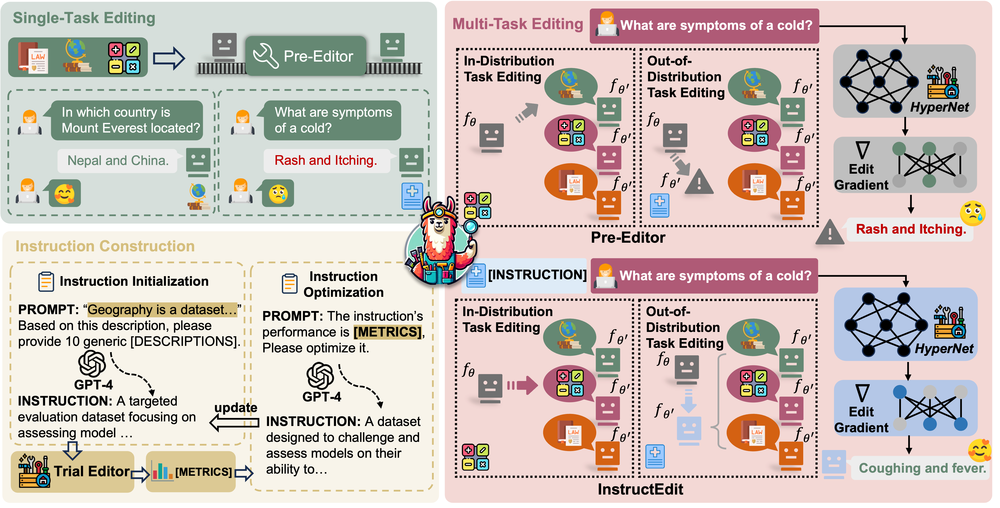

<h1 align="center">InstructEdit</h1>

**InstructEdit: Instruction-Based Knowledge Editing for Large Language Models**

<p align="center">
  📃 <a href="https://arxiv.org/abs/2402.16123" target="_blank">ArXiv</a> • 🤗 <a href="https://huggingface.co/papers/2402.16123" target="_blank">HF Paper</a> <br>
</p>

[](https://pytorch.org/)

[](https://github.com/zjunlp/MolGen/blob/main/LICENSE)


<div align=center></div>

# 🔔 Overview

**InstructEdit** enhances the Multi-Task Editor by guiding it to choose the right "tool" for different tasks. Normally, the editor might not always pick the best approach on its own. With InstructEdit, when you give clear instructions, the editor gets better at understanding what you need and acts more effectively.

# 📚 Resource Download
    

You can download the datasets we used from KnowEdit via Huggingface: [KnowEdit](https://huggingface.co/datasets/zjunlp/KnowEdit). Moreover, the details of datasets can be found [here](https://github.com/zjunlp/EasyEdit/blob/main/examples/KnowEdit.md).

The expected structure of files is:

```
EasyEdit
├── data
│   ├── all_train.json                                  # use for GPT2-XL
│   ├── all_test.json        # use for FT-L, CaliNet and GRACE in GPT2-XL
│   ├── wo_convsent_train.json                           # use for LLaMA2
│   ├── wo_convsent_test.json # use for FT-L, CaliNet and GRACE in LLaMA2
│   ├── convsent_test_reconstruct.json            # use for other methods
│   ├── test_cf.json                              # use for other methods
│   ├── recent_test.json                          # use for other methods
│   ├── zsre_mend_eval_portability_gpt4.json      # use for other methods
``` 

The files `test_cf.json`, `recent_test.json`, and `zsre_mend_eval_portability_gpt4.json` are sourced directly from **KnowEdit**. The `all_train.json` file combines all three tasks (ConvSent, CounterFact, and Recent) along with their task types. The `wo_convsent_train.json` file combines the two tasks, excluding ConvSent.

# 🚀 How to run

+ ## Training *InstructEdit*

    - Training **InstructEdit** with `GPT-XL`:.

    ```python
    from easyeditor import BaseEditor
    from easyeditor import MENDTrainingHparams, MENDHyperParams
    from easyeditor import MultiTaskDataset
    from easyeditor import MultiTaskTrainer
    def train_InstructEdit():
        training_hparams = MENDTrainingHparams.from_hparams('hparams/TRAINING/MEND/gpt2-xl-instruct.yaml')
        train_ds = MultiTaskDataset('data/all_train.json', config=training_hparams)
        size = training_hparams.val_steps if isinstance(training_hparams.val_steps, int) else 100
        eval_ds = train_ds[-size:]
        trainer = MultiTaskTrainer(
            config=training_hparams,
            train_set=train_ds,
            val_set=eval_ds
        )

        trainer.run()
    ```

    - Training **InstructEdit** with `LLaMA2`:

    ```python
    from easyeditor import BaseEditor
    from easyeditor import MENDTrainingHparams, MENDHyperParams
    from easyeditor import MultiTaskDataset
    from easyeditor import MultiTaskTrainer
    def train_InstructEdit():
        training_hparams = MENDTrainingHparams.from_hparams('hparams/TRAINING/MEND/llama-7b-instruct.yaml')
        train_ds = MultiTaskDataset('data/wo_convsent_train.json', config=training_hparams)
        size = training_hparams.val_steps if isinstance(training_hparams.val_steps, int) else 100
        eval_ds = train_ds[-size:]
        trainer = MultiTaskTrainer(
            config=training_hparams,
            train_set=train_ds,
            val_set=eval_ds
        )

        trainer.run()
    ```

+ ## Evaluating *InstructEdit*

    - Evaluating **InstructEdit** on `WikiRecent`:

    ```shell
    python test_InstructEdit.py \
        --editing_method=InstructEdit \
        --hparams_dir=hparams/MEND/gpt2-xl-instruct.yaml \
        --data_dir=data \
        --data_type=wikirecent \
        --data=recent_test.json
    ```

    - To evaluate **InstructEdit** on all three tasks, you can use the provided script with the following command:


    ```shell
        bash test_InstructEdit.sh
    ```

# Citation

If you use or extend our work, please cite the paper as follows:

```bibtex
@misc{zhang2024comprehensive,
      title={A Comprehensive Study of Knowledge Editing for Large Language Models}, 
      author={Ningyu Zhang and Yunzhi Yao and Bozhong Tian and Peng Wang and Shumin Deng and Mengru Wang and Zekun Xi and Shengyu Mao and Jintian Zhang and Yuansheng Ni and Siyuan Cheng and Ziwen Xu and Xin Xu and Jia-Chen Gu and Yong Jiang and Pengjun Xie and Fei Huang and Lei Liang and Zhiqiang Zhang and Xiaowei Zhu and Jun Zhou and Huajun Chen},
      year={2024},
      eprint={2401.01286},
      archivePrefix={arXiv},
      primaryClass={cs.CL}
}

@misc{tian2024instructedit,
  title={InstructEdit: Instruction-based Knowledge Editing for Large Language Models}, 
  author={Bozhong Tian and Siyuan Cheng and Xiaozhuan Liang and Ningyu Zhang and Yi Hu and Kouying Xue and Yanjie Gou and Xi Chen and Huajun Chen},
  year={2024},
  eprint={2402.16123},
  archivePrefix={arXiv},
  primaryClass={cs.CL}
}
```
    