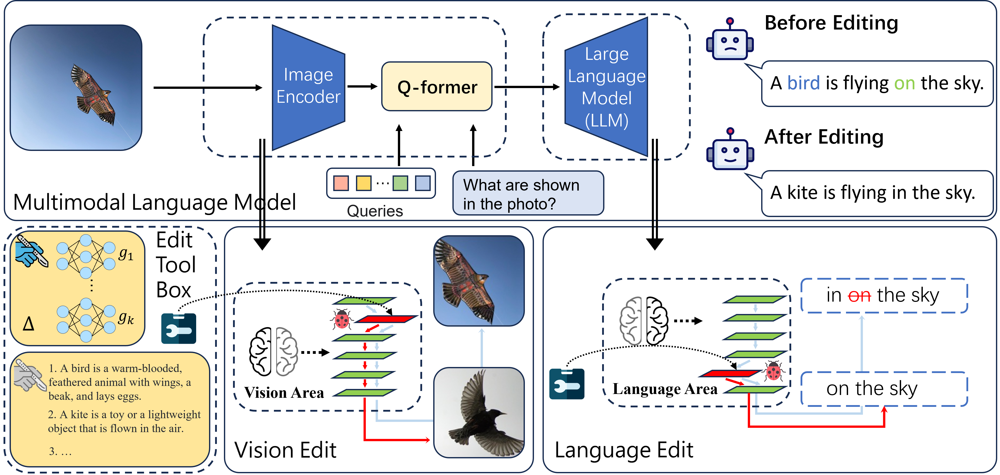

<div align="center">
<h1> Can We Edit Multimodal Large Language Models? </h1>
</div>

## Table of Contents

- [Overview](#overview)
    + [Pip Installation](#pip-installation)
    + [Checkpoints Preparation](#checkpoints-preparation)
- [📕 MMEdit Datasets](#📕-mmedit-datasets)
- [📌 Use EasyEdit](#📌-use-easyedit)
    + [MultimodalTrainer](#multimodaltrainer)
    + [MultimodalEditor](#multimodaleditor)
- [🎉 Acknowledgement](#🎉-acknowledgement)
- [📖 Citation](#📖-citation)

# Overview
<div align="center">
    
</div>

# 📕 MMEdit Datasets

| **dataset** | Google Drive| BaiduNetDisk | Description |
| :--------: | :-----------------------------------------------------------------------------------------------: | :-----------------------------------------------------------------------------: | :--------------------------------------------------------------------------------: |
| E-IC | [[Google Drive]](https://drive.google.com/drive/folders/1jBdTJxUb9wEeHnvG-RY8dv5_I4QlDpUS?usp=drive_link) | [[BaiduNetDisk]](https://pan.baidu.com/s/1g9nMv-5BJmztxYU-BWRdvg?pwd=ik5c) | dataset for editing _Image Captioning_ |
| E-VQA | [[Google Drive]](https://drive.google.com/drive/folders/1jBdTJxUb9wEeHnvG-RY8dv5_I4QlDpUS?usp=drive_link) | [[BaiduNetDisk]](https://pan.baidu.com/s/1g9nMv-5BJmztxYU-BWRdvg?pwd=ik5c) | dataset for editing _Visual Question Answering_ |

- All **images** used in **E-IC** and **E-VQA** are available for download at [Google Drive](https://drive.google.com/file/d/1fQzJBFkok5kFZT6QUuT-HCuYKk2Vb93O/view)
- For **locality**, it is the same as factual editing in order to measure whether unrelated facts retain their outputs.
- For **multimodal locality**, it assesses the impact of editing on the visual module, which is similar to regular **locality**.

<details><summary> <b> dataset description </b> </summary>

```text
editing-data
├── caption
│   ├── caption_train_edit.json
│   └── caption_eval_edit.json
├── locality
│   ├── NQ dataset
│   │   ├── train.json
│   │   └── validation.json
├── multimodal_locality
│   ├── OK-VQA dataset
│   │   ├── okvqa_loc.json
└── vqa
    ├── vqa_train.json
    └── vqa_eval.json
```
- `Multimodal locality` (evaluation for multimodal locality, see dataset's details in this [paper](http://openaccess.thecvf.com/content\_CVPR\_2019/html/Marino\_OK-VQA\_A\_Visual\_Question\_Answering\_Benchmark\_Requiring\_External\_Knowledge\_CVPR\_2019\_paper.html)) 
</details>

# 🔧 Requirements

### Pip Installation

**Note: Please use Python 3.9+ for EasyEdit**
To get started, simply install conda and run:

```bash
git clone https://github.com/zjunlp/EasyEdit.git
conda create -n EasyEdit python=3.9.7
...
pip install -r requirements.txt
```

### Checkpoints Preparation

You should configure the `qformer_checkpoint` and `pretrained_ckpt` settings, deviating from the original repository's guidelines. Please refer to the *Multimodal* section in this [file](https://github.com/zjunlp/EasyEdit/blob/5efc6e4f7757613def2b514b60f24d7c38497095/hparams/MEND/minigpt4.yaml) for the correct settings.
`pretrained_ckpt` can be downloaded from [here](https://drive.google.com/file/d/1RY9jV0dyqLX-o38LrumkKRh6Jtaop58R/view), and for the `qformer_checkpoint`, you can find it [here](https://storage.googleapis.com/sfr-vision-language-research/LAVIS/models/BLIP2/blip2_pretrained_flant5xxl.pth).

# 📌Use EasyEdit

### MultimodalTrainer

- Meta-learning based: `MEND`
- Memory-based routing: `SERAC`

For above editing methods, pre-training of corresponding meta-networks or classifiers is required. Therefore, in EasyEdit, we provide a unified framework for pretraining the relevant network structures. Take the training SERAC for example:

**Step1: Define a MLLM as the object to be edited.**
Choose the MLLM to be edited. `EasyEdit` supports partial multimodal models(`MiniGPT-4`, `BLIP2OPT` so far). The corresponding configuration file directory is `hparams/TRAINING/YUOR_METHOD/YOUR_MODEL.YAML` for training, such as `hparams/TRAINING/MEND/minigpt4.yaml`, set the corresponding `model_name` to select the object for editing. And `hparams/YUOR_METHOD/YOUR_MODEL.YAML` for evaluating.

```python
model_name: minigpt4
model_class: Blip2OPT
tokenizer_class: LlamaTokenizer
tokenizer_name: Vicuna
```

**Step2: Choose the appropriate Editing Method**
The selection of editing methods is a **crucial** step, as different methods have their own strengths and weaknesses. Users need to consider the trade-off between editing success rate, generalization, and maintaining unrelated performance.

```python
## In this case, we use SERAC method, so you should import `SERACMultimodalTrainingHparams` for training
from easyeditor import SERACMultimodalTrainingHparams
## Loading config from hparams/TRAINING/SERAC/minigpt4.yaml
training_hparams = SERACMultimodalTrainingHparams.from_hparams('./hparams/TRAINING/SERAC/minigpt4.yaml')
```

**Step3: Provide the edit training set**
The currently supported and available datasets are: `Caption` and `VQA` ([Google Drive](https://drive.google.com/drive/folders/1jBdTJxUb9wEeHnvG-RY8dv5_I4QlDpUS?usp=drive_link)). Please place them in the "data" directory and initialize the dataset_class (`CaptionDataset` for Caption and `VQADataset` for VQA) to load the corresponding training set.

```python
train_ds = CaptionDataset('data/caption_train_edit.json', config=training_hparams)
eval_ds = CaptionDataset('data/caption_eval_edit.json', config=training_hparams)
```

**Step4: Combine them into a `Trainer`**

```python
trainer = MultimodalTrainer(
    config=hparams,
    train_set=train_ds,
    val_set=eval_ds
)
```

**Step5: Run and Edit**
Done! We can conduct Run and Evaluation.

```python
trainer.run()
```

- Run: The `CHECKPOINT` will be saved to the path `results_dir`.
- Edit: Set the `archive` field in the **hparams file** to `CHECKPOINT`. EasyEdit will automatically load the corresponding pre-trained weights during the editing process ([Go to edit](#use-easyedit)).

**Training Example**
```python
training_hparams = SERACMultimodalTrainingHparams.from_hparams('hparams/TRAINING/SERAC/minigpt4.yaml')
train_ds = CaptionDataset('data/caption_train_edit.json', config=training_hparams)
eval_ds = CaptionDataset('data/caption_eval_edit.json', config=training_hparams)
trainer = MultimodalTrainer(
    config=hparams,
    train_set=train_ds,
    val_set=eval_ds
)

trainer.run()
```

**Evaluating Example**
```python
hparams = SERACMultimodalHparams.from_hparams('hparams/SERAC/minigpt4.yaml')
# train_ds = CaptionDataset('data/caption_train_edit.json', config=hparams)
eval_ds = CaptionDataset('data/caption_eval_edit.json', config=hparams)
trainer = MultimodalTrainer(
    config=hparams,
    train_set=eval_ds,
    val_set=eval_ds
)

trainer.run()
```

The results will include the following metrics:

- `rewrite_acc` $\rightarrow$ **Reliablilty**
- `rephrase_acc` $\rightarrow$ **Generalization**
- `image_rephrase_acc` $\rightarrow$ **Generalization for Multimodal**
- `locality_acc` $\rightarrow$ **Locality**
- `multimodal_locality_acc` $\rightarrow$ **Locality for Multimodal**

### MultimodalEditor

> `MultimodalEditor` is the class for Multi-Modality Editing. You can choose the appropriate editing method (such as `IKE`) based on your specific needs.

- Due to different transformer versions and different GPU models, the editing results may fluctuate **slightly**.

**Step1: Generate embedding files for IKE** You can use `Generate_Embedding_for_IKE()` in `multimodal_edit.py` to generate directly.

```python
## Generate embedding files for IKE

hparams = IKEMultimodalHyperParams.from_hparams('hparams/IKE/blip2.yaml')
train_ds = VQADataset('data/vqa_train.json', config=hparams)
sentence_model = SentenceTransformer(hparams.sentence_model_name).to(f'cuda:{hparams.device}')
encode_ike_facts_multimodal(sentence_model, train_ds, hparams)
```

**Step2: Run and Edit!** Select specific model and dataset, then use `test_IKE_MiniGPT4_Caption()` in `multimodal_edit.py` to run.

```python
hparams = IKEMultimodalHyperParams.from_hparams('hparams/IKE/minigpt4.yaml')
editor = MultimodalEditor.from_hparams(hparams)
eval_ds = CaptionDataset('data/caption_eval_edit.json', config=hparams)
metrics, edited_model, _ = editor.edit_dataset(
    ds=eval_ds,
    train_ds=eval_ds,
    keep_original_weight=True        
)
```

## 🎉 Acknowledgement

We would like to express our sincere gratitude to the excellent work [LAVIS](https://github.com/salesforce/LAVIS/tree/main), [MiniGPT-4](https://github.com/Vision-CAIR/MiniGPT-4), [SERAC](https://github.com/eric-mitchell/serac) and [MEND](https://github.com/eric-mitchell/mend).

## 📖 Citation

If finding this work useful for your research, you can cite it as follows:

```bibtex
@inproceedings{DBLP:conf/emnlp/0008TL0WC023,
  author       = {Siyuan Cheng and
                  Bozhong Tian and
                  Qingbin Liu and
                  Xi Chen and
                  Yongheng Wang and
                  Huajun Chen and
                  Ningyu Zhang},
  editor       = {Houda Bouamor and
                  Juan Pino and
                  Kalika Bali},
  title        = {Can We Edit Multimodal Large Language Models?},
  booktitle    = {Proceedings of the 2023 Conference on Empirical Methods in Natural
                  Language Processing, {EMNLP} 2023, Singapore, December 6-10, 2023},
  pages        = {13877--13888},
  publisher    = {Association for Computational Linguistics},
  year         = {2023},
  url          = {https://aclanthology.org/2023.emnlp-main.856},
  timestamp    = {Wed, 13 Dec 2023 17:20:20 +0100},
  biburl       = {https://dblp.org/rec/conf/emnlp/0008TL0WC023.bib},
  bibsource    = {dblp computer science bibliography, https://dblp.org}
}
```