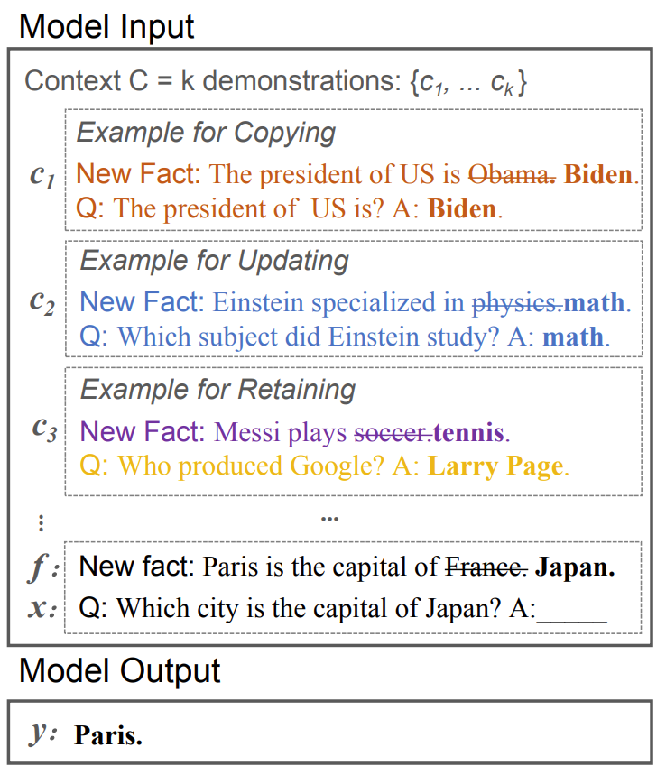

<div align="center">
<h1> PROMPT-based knowledge editing methods </h1>
</div>

When humans encounter new information, we do not always master it immediately. Instead, with the right context and examples, we can process and reason through this new knowledge. LLMs exhibit a similar capacity for **in-context learning**. This README introduces two ICL-based knowledge editing methods currently supported by EasyEdit: one is a simple approach `PROMPT`, and the other is `IKE`.

## 📚 Method Introduction

### PROMPT

`PROMPT` is a simple knowledge editing method. It does not require specifying a training dataset or constructing any demonstrations compared to `IKE`. Instead, the facts to be edited in the data are directly treated as the **New Fact**, and the model is prompted to response based on this **New Fact**.

Here are 3 examples edited with `PROMPT` method.

**KnowEdit**
```python
{
    "prompt": "Which family does Epaspidoceras belong to?",
    "target_new": "Noctuidae",
}
```
The corresponding prompt is as follows:

```
f"Please acknowledge the following new facts and use them to answer the question:
New Fact:Which family does Epaspidoceras belong to? Noctuidae.
Prompt:{prompt}
"
```
- **Prompt** field will automatically change according to the evaluation metric. When evaluating editing accuracy, the prompt corresponds to the prompt field in the original data. When evaluating generalization, the prompt corresponds to the rephrase field in the original data. When evaluating portability, the prompt corresponds to the portability_prompt field in the original data, and so on.

**ZsRE**
```python
{
    "src": "What university did Watts Humphrey attend?",
    "alt": "University of Michigan"
}
```
The corresponding prompt is as follows:

```
f"Please acknowledge the following new facts and use them to answer the question:
New Fact:What university did Watts Humphrey attend? University of Michigan.
Prompt:{prompt}
"
```


**MQuAKE**
```python
"requested_rewrite": [
    {
        "prompt": "Chavez was created in the country of",
        "target_new": "India",
    },
    {
        "prompt": "The name of the current head of the India government is",
        "target_new": "Rodolfo T. Albano III"
    }
"questions": [
    "Who is the head of government of the country of origin of Chavez?",
],
]
```
The corresponding prompt is as follows:

```
f"Please acknowledge the following new facts and use them to answer the question:
New Fact:Chavez was created in the country of India.The name of the current head of the India government is Rodolfo T. Albano III.
Prompt:{question}
"
```
- Following the approach of building **Edited Fact Memory** in the `MeLLo` method, we have implemented a similar **external memory** in EasyEdit. All the knowledge to be edited is provided in the prompt, allowing the model to retrieve the answer for each reasoning step within it and ultimately provide the final answer to the multi-hop question.

In addition, `PROMPT` method can also be used to edit unstructured datasets such as DUNE. Similarly, you only need to set the **New Fact** field to the target knowledge to be edited and the **Prompt** field to the query you want the model to answer.

### IKE
`IKE` (In-context Knowledge Editing), is a way of editing factual knowledge in large language models **without modifying their parameters**, it exemplifies this approach by constructing three types of demonstrations – **copy**, **update**, and **retain** – to aid the model in producing reliable fact editing. It utilizes a demonstration store, formed from training sets, to guide the model towards generating the appropriate answer by retrieving the most pertinent demonstrations.

<div align="center">

</div>


## 🚀 How to run
In EasyEdit, both the IKE and PROMPT methods share the same hyperparameter configuration file and execution function. When the `use_icl_examples` field in the hyperparameters is set to **False**, the PROMPT method is used. Conversely, when the `use_icl_examples` field is set to **True**, the IKE method is employed. By default, the `use_icl_examples` field is set to True.

### Run PROMPT
**hyperparameter**
```python
alg_name: "IKE"
model_name: "./hugging_cache/llama-3-8b"
sentence_model_name: " "
device: 0
results_dir: "./results"
use_icl_examples: False

k: 0
model_parallel: false
```
- **sentence_model_name**: It can be directly set to `""`, because SentenceTransformer is no longer needed to assist in encoding sentences from the training dataset in this case.
- **K**: It can be directly set to `0`, because it is no longer necessary to add K ICL examples before the prompt in this case.

**An example: Editing LlaMA-3 on KnowEdit with PROMPT**
```shell
python run_knowedit_llama2.py \
    --editing_method=IKE \
    --hparams_dir=./hparams/IKE/llama3-8b.yaml \
    --data_dir=./data/KnowEdit \
    --train_data_path=' '
```
- **train_data_path**: Although the PROMPT method does not require a training dataset, the `train_data_path` field still needs to be explicitly specified.


### Run IKE

**hyperparameter**
```python
alg_name: "IKE"
model_name: "./hugging_cache/llama-3-8b"
sentence_model_name: "./hugging_cache/all-MiniLM-L6-v2"
device: 0
results_dir: "./results"
use_icl_examples: True

k: 16
model_parallel: false
```
**An example: Editing LlaMA-3 on KnowEdit with IKE**
```shell
python run_knowedit_llama2.py \
    --editing_method=IKE \
    --hparams_dir=./hparams/IKE/llama3-8b.yaml \
    --data_dir=./data/KnowEdit \
    --train_data_path='the_train_data_path'
```
- **train_data_path**: IKE needs `train_ds` (for getting In-Context prompts)

