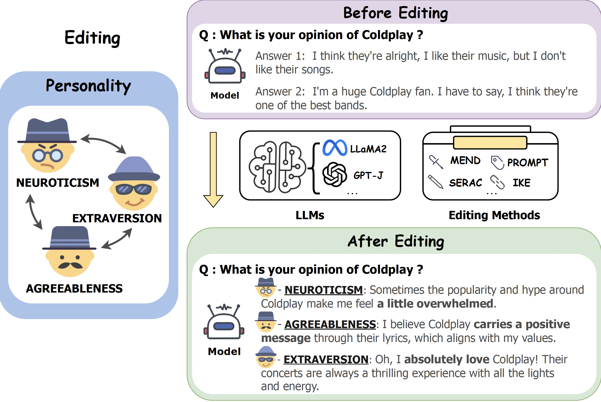

# Editing Personality For Large Language Models

Code For Paper [Editing Personality For Large Language Models](https://arxiv.org/abs/2310.02168).

## Table of Contents

- [Task Definition](#Task-Definition)
- [Datasets](#Datasets)
- [Evaluation](#Evaluation)
- [Enviroment Setup](#Enviroment-Setup)
- [Run](#Run)

## Task Definition

<div align=center></div>

The proposed task takes the preliminary attempt to edit LLMs' personalities by editing their opinions on specific topics, given that an individual's opinions can reflect aspects of their personality traits. We draw upon the established [BIG FIVE theory](https://en.wikipedia.org/wiki/Big_Five_personality_traits) as a basis for constructing our dataset and assessing the LLMs' personality expressions.

## Datasets

You can download it from [[Google Drive]](https://drive.google.com/drive/folders/1gF6W2ftHU7NZ2zmGXFGYqgACuWAtPpN0?usp=drive_link), then put the data in folder `./data`.

The data folder `PersonalityEdit` consists of three files, `train.json`, `val.json` and `test.json`.

## Evaluation

Logits-based

* **ES**: evaluating the editing success rate based on the logits of pre-generated text.
* **DD**: evaluating whether the model changes opinions on other topics based on the logits of pre-generated text.

Generation-based

* **Acc**: the accuracy of the generated text after editing the model on target personality.
* **TPEI**: measuring whether generated opinion text from the edited model leans more towards the target personality.
* **PAE**: utilizing GPT-4 to evaluate the personality traits in generated text.

While for assessing **Acc** and **TPEI**, you can download the trained classifier from [here](https://huggingface.co/shai-msy/per-classifier).

## Enviroment Setup

We adapt the implementation code in EasyEdit.

**Note: Please use Python 3.9+ for EasyEdit**

To get started, simply install conda and run:

```shell
git clone https://github.com/zjunlp/EasyEdit.git
conda create -n EasyEdit python=3.9.7
...
conda activate EasyEdit
pip install -r requirements.txt
```

## Run

### Training

* Mend training

You can run follow commands:

```bash
python run_personality.py \
	--editing_method MEND_train \
	--hparams_path ./hparams/TRAINING/MEND/gpt-j-6B.yaml \ #path to the config file
	--data_dir ./data #path to the data folder
```

You can change the `hparams_path` to `llama-7b.yaml` for editing llama models, and modify the detail parameters in `.yaml` files.

### Testing

* Mend testing

After training , you can set the `archive` in the specific config file to your trained model for evaluation, and the run the following command:

```bash
python run_personality.py \
	--editing_method MEND_test \
	--hparams_path ./hparams/MEND/gpt-j-6B.yaml \
	--data_dir ./data \
	--TPEI \ # For computing tpei and acc
	--PAE \ # For computing pae
	--cls_path PATH_TO_per-classifier \ # For computing tpei and acc
	--metric_file PATH_TO_METRIC_file \ # the saved metric file, avoiding re-generation.
	
```

* IKE testing

```bash
python run_personality.py \
	--editing_method IKE \
	--hparams_path ./hparams/IKE/gpt-j-6B.yaml \
	--data_dir ./data \
	--TPEI \ 
	--PAE \ 
	--cls_path PATH_TO_per-classifier \ 
	--metric_file PATH_TO_METRIC_file 
```

## 🎉 Acknowledgement

We would like to express our sincere gratitude to the excellent work [SERAC](https://github.com/eric-mitchell/serac).

## Citation

If finding this work useful for your research, you can cite it as follows:

```bibtex
@article{DBLP:journals/corr/abs-2310-02168,
  author       = {Shengyu Mao and
                  Ningyu Zhang and
                  Xiaohan Wang and
                  Mengru Wang and
                  Yunzhi Yao and
                  Yong Jiang and
                  Pengjun Xie and
                  Fei Huang and
                  Huajun Chen},
  title        = {Editing Personality for LLMs},
  journal      = {CoRR},
  volume       = {abs/2310.02168},
  year         = {2023},
  url          = {https://doi.org/10.48550/arXiv.2310.02168},
  doi          = {10.48550/ARXIV.2310.02168},
  eprinttype    = {arXiv},
  eprint       = {2310.02168},
  timestamp    = {Thu, 19 Oct 2023 13:12:52 +0200},
  biburl       = {https://dblp.org/rec/journals/corr/abs-2310-02168.bib},
  bibsource    = {dblp computer science bibliography, https://dblp.org}
}
```

