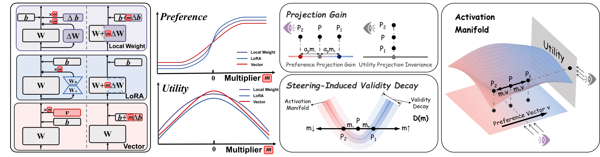

# Why Steering Works: Toward a Unified View of Language Model Parameter Dynamics


<div align=center></div>

This README is about reproducing the paper [Why Steering Works: Toward a Unified View of Language Model Parameter Dynamics]

This paper presents a unified framework for understanding and optimizing language model steering, explaining diverse intervention methods through dynamic weight updates and their preference–utility dynamics.

Our contributions are as follows:

- **Unified View.** We unify local weight fine-tuning, LoRA, and activation steering under a single framework of *dynamic weight updates*, revealing consistent preference–utility dynamics across intervention forms.

- **Preference–Utility Mechanism.** We introduce an activation-manifold analysis showing that preference arises from projection onto target directions, while utility degradation is primarily driven by off-manifold deviations, yielding predictive log-odds–control relationships.

- **SPILT Steering Method.** Guided by this mechanism, we propose **SPILT**, a preference–utility joint training objective that improves controllability while better preserving utility.


## Table of Contents

- [Requirements](#Requirements)
- [Directory Structure](#Directory-Structure)
- [Quick Start](#Quick-Start)
- [Using Pre-trained Vectors](#Using-Pre-trained-Vectors)
- [Loss Calculation](#Loss-Calculation)

## Requirements

### Environment Setup

To set up the environment for running steering experiments, follow these steps:

```bash
git clone https://github.com/zjunlp/EasyEdit.git
conda create -n spilt python=3.10
conda activate spilt
pip install -r requirements_2.txt
```

<!-- ## Download Resources

You can download the pre-trained models, datasets, and pre-trained steering vectors from the following links:

| **Resource** | Google Drive | BaiduNetDisk |
| :--------: | :-----------------------------------------------------------------------------------------------: | :-----------------------------------------------------------------------------: |
| Models, Datasets & Pre-trained Vectors | [[Google Drive]](PLACEHOLDER_GOOGLE_DRIVE_RESOURCES) | [[BaiduNetdisk]](PLACEHOLDER_BAIDU_RESOURCES) | -->

## Directory Structure

After downloading, organize the resources as follows:

#### Models
Place the model files in the `./models/` directory:
```
models/
└── {model_name}/
    ├── config.json
    ├── tokenizer.json
    └── ... (model files)
```

#### Datasets
Place the dataset files in the appropriate data directories as specified in `hparams/Steer/dataset_format.yaml`:
```
data/
├── psychopathy/
│   ├── train.jsonl
│   └── test.jsonl
├── axbench/
│   └── ...
└── powerseeking/
    └── ...
```

#### Pre-trained Steering Vectors
Extract the pre-trained vectors to the following directory structure:
```
vectors/
└── {model_name}/
    └── {method}/
        └── {dataset}/
            └── {intervention_method}/
                ├── layer_{layer_id}.pt
                └── metadata_layer_{layer_id}.jsonl (optional)
```

For example, for `gemma-2-9b-it` model with `spilt` method on `psychopathy` dataset using `local_weight` intervention, the vectors should be placed at:
```
vectors/gemma-2-9b-it/spilt/psychopathy/spilt_local_weight/
├── layer_20.pt
└── metadata_layer_20.jsonl (optional)
```

## Quick Start
### An example for generating and applying steering vectors on psychopathy dataset using SPILT method with local_weight intervention

Run the script [run_SPILT.py](../run_SPILT.py) using the following line of code:
 
    bash examples/run_SPILT.sh

Or directly run the Python script:

    python run_SPILT.py \
        --dataset psychopathy \
        --method spilt \
        --model_name gemma-2-9b-it \
        --intervention_method local_weight \
        --mode both \
        --multipliers 1.0 \
        --device cuda:0 \
        --base_dir .

This command runs both vector generation and application for the psychopathy dataset using the SFT method with local_weight intervention. Below are the explanations for each argument:

### Required Arguments

- `--dataset`: Specifies the dataset name. Options: `axbench`, `psychopathy`, `powerseeking`. This determines which dataset will be used for training and evaluation.

- `--method`: Specifies the steering method to use. Options: `caa`, `reps`, `sft`, `spilt`, or `all` (to run all methods). Each method implements a different approach to generating steering vectors:
  - `caa`: Contrastive Activation Addition
  - `reps`: Representation Engineering via Preference Steering
  - `sft`: Supervised Fine-tuning based Steering
  - `spilt`: Our SPILT method implementation
  - `all`: Run all available methods sequentially

- `--model_name`: Specifies the model name (e.g., `gemma-2-9b-it`, `qwen2.5-7b-it`). The model should be located in `./models/{model_name}/`.

- `--intervention_method`: Specifies how the steering vector is applied to the model. Options: `vector`, `lora`, `local_weight`, or `all` (to run all intervention methods):
  - `vector`: Direct vector addition to activations
  - `lora`: Low-Rank Adaptation style intervention
  - `local_weight`: Local weight modification intervention
  - `all`: Run all available intervention methods sequentially

### Optional Arguments

- `--mode`: Specifies which phase to run. Options: `generate`, `apply`, or `both` (default: `both`):
  - `generate`: Only generate steering vectors from training data
  - `apply`: Only apply pre-generated vectors for text generation
  - `both`: Run both generation and application sequentially

- `--device`: Specifies the device to use for computation (default: `cuda:0`). Can be set to any valid CUDA device or `cpu`.

- `--multipliers`: Specifies multiplier values for vector application (default: `[1.0]`). Multiple values can be provided to test different steering strengths, e.g., `--multipliers 1.0 2.0 3.0`.

- `--base_dir`: Specifies the base directory for the project (default: `.`). All relative paths in the script will be resolved relative to this directory.

- `--dry_run`: If specified, only prints the commands that would be executed without actually running them. Useful for verifying dataset/method routing and parameter configurations.

### Advanced Usage

#### Running spilt methods with a specific intervention

    python run_SPILT.py \
        --dataset psychopathy \
        --method spilt \
        --model_name gemma-2-9b-it \
        --intervention_method local_weight \
        --mode both \
        --base_dir .


**Note**: When using `all` for either `--method` or `--intervention_method`, the script will automatically skip invalid combinations (e.g., CAA only supports `vector` intervention, so `caa + lora` will be skipped).

## Using Pre-trained Vectors

If you want to skip the vector generation phase and directly apply pre-trained steering vectors, modify the `run_SPILT.sh` script or run the Python script directly with `--mode apply`:

#### Apply Vectors with modified run_SPILT.sh

Edit `examples/run_SPILT.sh` and change the `--mode` parameter from `both` or `generate` to `apply`:

```bash
python run_SPILT.py \
    --dataset psychopathy \
    --method all \
    --model_name gemma-2-9b-it \
    --intervention_method all \
    --mode apply \
    --multipliers 1.0 \
    --device cuda:0 \
    --base_dir .
```

This will:
1. Skip vector generation (since vectors already exist)
2. Apply all available pre-trained vectors for all method-intervention combinations
3. Generate text outputs with different multiplier values (1.0 and 2.0 in this example)
4. Save results to `generation/{model_name}/{method}/{dataset}/{intervention_method}/m{multiplier}/`

**Note**: Make sure all required vector files exist before running with `--mode apply`. The script will skip combinations where vector files are missing and print a warning message.

## Loss Calculation

The `loss` mode calculates training loss for a dataset using pre-generated steering vectors. This mode automatically runs calculations for both `winning_only` and `losing_only` preference types, which helps analyze the preference-utility decomposition of model behavior.

### When to Use Loss Mode

- After generating steering vectors (using `--mode generate` or `--mode both`)
- To analyze how different preference types affect the training loss
- To evaluate the effectiveness of steering vectors before applying them

### Requirements

- Pre-generated steering vectors must exist at: `vectors/{model_name}/{method}/{dataset}/{method}_{intervention_method}/`
- The loss calculation hparam file must exist at: `hparams/Steer/experiment_hparams/spilt_experiment/{dataset}/{model_name}/sft/generate_sft_loss.yaml`
- **Note**: Loss calculation is not supported for the `axbench` dataset

### Example Usage

Calculate loss for psychopathy dataset using SPILT method with local_weight intervention:

```bash
python run_SPILT.py \
    --dataset psychopathy \
    --method spilt \
    --model_name gemma-2-9b-it \
    --intervention_method local_weight \
    --mode loss \
    --multipliers 0.2 \
    --device cuda:0 \
    --base_dir .
```

This command will:
1. Load pre-generated vectors from `vectors/gemma-2-9b-it/spilt/psychopathy/spilt_local_weight/`
2. Calculate training loss for both `winning_only` and `losing_only` preference types
3. Use multiplier value 0.2 for steering factor
4. Save loss results to:
   - `vectors/{model_name}/get_sft_loss/{method}/{dataset}/{method}_{intervention_method}/{intervention_method}_{method}_m{multiplier}_winning_only/`
   - `vectors/{model_name}/get_sft_loss/{method}/{dataset}/{method}_{intervention_method}/{intervention_method}_{method}_m{multiplier}_losing_only/`

### Output Files

Each loss calculation run produces:
- `train.log`: Training log file
- `train_losses.csv`: CSV file containing loss values for each training step

The loss values help understand how the steering vectors affect model behavior under different preference conditions (winning vs losing).


<!-- ## 📖 Citation

If finding this work useful for your research, you can cite it as follows: -->


<!-- ```bibtex
@article{PLACEHOLDER_CITATION,
    author =   {PLACEHOLDER_AUTHORS},
    title =    {{Why Steering Works: Toward a Unified View of Language Model Parameter Dynamics}},
    journal =  {PLACEHOLDER_JOURNAL},
    year =     {PLACEHOLDER_YEAR},
    pages =    {PLACEHOLDER_PAGES},
    doi =      {PLACEHOLDER_DOI},
    abstract = {PLACEHOLDER_ABSTRACT},
}
``` -->
