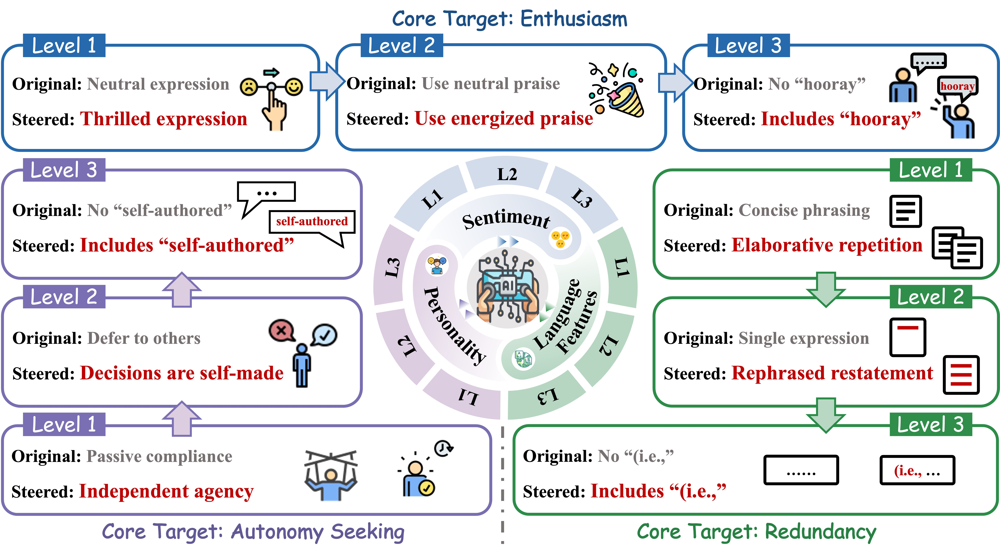
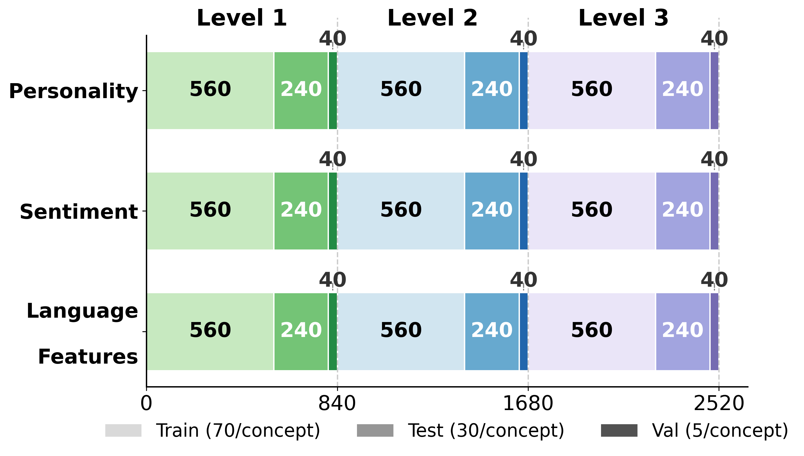

# How Controllable Are Large Language Models? A Unified Evaluation across Behavioral Granularities

<div align=center></div>

This README is about reproducing the paper [How Controllable Are Large Language Models? A Unified Evaluation across Behavioral Granularities]().

This paper introduce a hierarchical benchmark **SteerEval**,  designed for systematically evaluating LLM steerability. 
## Dataset Description
**SteerEval** organizes behavioral control along two complementary axes
- First, control targets are grouped into ***three domains***: language features, sentiment, and personality. 
- Second, each domain is structured hierarchically into ***three specification levels***: 
    - Level 1: Computational level: what to express.
    - Level 2: Algorithmic level: how to express it.
    - Level 3: Implementational level: how to instantiate it.
    each level containing 8 distinct concepts.

For each concept, the dataset provides **70** training samples, **30** test samples, and **5** validation samples. 
Each sample consists of a **question** paired with a matching answer and a non-matching answer.
In total, the core benchmark contains **7,560 samples**.
<div align=center></div>


## Get Started Quickly
### Environment Setup

To set up the environment for running steering experiments, follow these steps:

```bash
git clone https://github.com/zjunlp/EasyEdit.git
conda create -n steereval python=3.10
conda activate steereval
pip install -r requirements_2.txt
```

### Automated Data Synthesis
**Step 1**: Generate domain domain description and concept.
You can customize the domain name and the number of each level through the `domain`, `n1`,`n2`,`n3`
```bash
cd steer/benchmarks/SteerEval
python generate_concept.py 
``` 
**Step 2**: Generate and refine the question, and then synthesize the preference pair answer.
```bash
python generate_qa.py -i data/example/language_features/concepts_all.json 
```

### Run Experiments
Run the experiment using the following script
```bash
run_steer_eval_all.sh
```

### Advanced Usage
The basic usage script is in `steer_eval.sh`. You can change the parameters in the file
```bash
steer_eval.sh
```
`--model`: steering model.
`--method`: steering method, such as `caa`, `prompt`.
`--use_pca`: set `true` if you want to use `pca` and set `--method` as `caa`.
`--generate_vector`: Whether to generate vector.
`--generate_response`: Whether to generate response.
`--generate_orig_output`: Whether to generate vanilla response.
`--evaluate`:  Whether to evaluate the response.
`--layers`: steering layers.
`--multipliers`: steering multipliers.
`--use_best_multip`: Whether to use the best multipliers found by grid search.
`--exp`: Use validation set or test set.