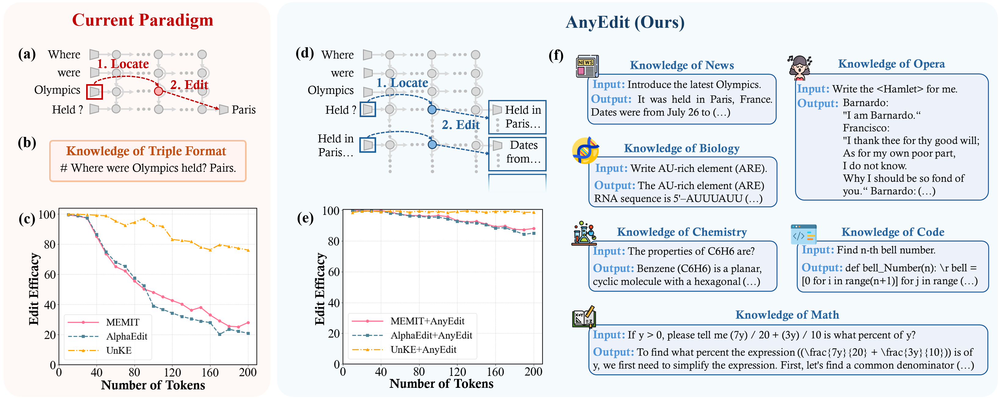

# AlphaEdit
- Code for [``AnyEdit: Edit Any Knowledge Encoded in Language Models``]

- In this work, we propose **AnyEdit**, a new autoregressive editing paradigm. It decomposes long-form knowledge into sequential chunks and iteratively edits the key token in each chunk, ensuring consistent and accurate outputs. Theoretically, we ground AnyEdit in the Chain Rule of Mutual Information, showing its ability to update any knowledge within LLMs. Empirically, it outperforms strong baselines by 21.5\% on benchmarks including UnKEBench, AKEW, and our new **EditEverything** dataset for long-form diverse-formatted knowledge. Additionally, AnyEdit serves as a plug-and-play framework, enabling current editing methods to update knowledge with arbitrary length and format, significantly advancing the scope and practicality of LLM knowledge editing.



## Requirements
**One A100 80G GPU.**

- pytorch==1.12.1
- einops==0.4.0
- higher==0.2.1
- hydra-core==1.2.0
- transformers==4.23.1
- datasets==1.18.3
- matplotlib==3.6.1
- spacy==3.4.1
- scipy==1.9.2
- scikit-learn==1.0.2
- nltk==3.7

## Quick Start
### An example for editing Llama3-8B-Instruct on UnKEBench dataset using AnyEdit
#### 1. Edit Llama3-8B-Instruct 
 
    python3 -m experiments.evaluate_uns     --alg_name=MEMIT_ARE     --model_name=meta-llama/Meta-Llama-3-8B-Instruct     --hparams_fname=Llama3-8B-Instruct.json     --ds_name=unke     --dataset_size_limit=1000     --num_edits=1

This command runs an evaluation script for the NSE algorithm using the Llama3-8b-instruct. Below are the explanations for each argument:

- `--alg_name=MEMIT_ARE`: Specifies the name of the algorithm being used, which is MEMIT+AnyEdit in this case.
- `--model_name=meta-llama/Meta-Llama-3-8B-Instruct`: Indicates the name of the model being evaluated, here it is Llama-3-8B-Instruct.
- `--hparams_fname=Llama3-8B-Instruct.json`: Points to the JSON file containing hyperparameters specific to the Llama-3-8B-Instruct model.
- `--ds_name=unke`: Specifies the dataset name, in this case, "unke".
- `--dataset_size_limit=1000`: Sets the total number of editing samples to 2000.
- `--num_edits=1`: Defines the batch size for each round of editing, meaning 1 edit will be performed in each batch. 
#### 2. Summarize the results

    python -m experiments.summarize_uns --file_path=output/...

## Acknowledgment
Our code is based on  [``MEMIT``](https://github.com/kmeng01/memit.git) and  [``UnKE``](https://github.com/TrustedLLM/UnKE.git).

## Citation

If you find this work useful, please cite our paper:

```bibtex
@article{anyedit,
  author       = {Houcheng Jiang and
                  Junfeng Fang and
                  Ningyu Zhang and
                  Guojun Ma and
                  Mingyang Wan and
                  Xiang Wang and
                  Xiangnan He and
                  Tat{-}Seng Chua},
  title        = {AnyEdit: Edit Any Knowledge Encoded in Language Models},
  journal      = {CoRR},
  volume       = {abs/2502.05628},
  year         = {2025}
}
